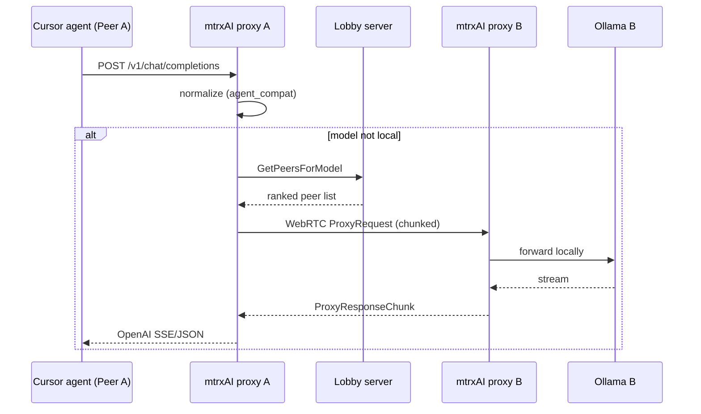

# Agent-to-Agent (A2A) Inference

Analysis of how mtrxAI can support agent-to-agent inference — agents delegating work across the mesh, not only routing a single prompt to a remote model.

See [NEXT_FEATURES.md](NEXT_FEATURES.md) for the roadmap index and [manifest.md](../manifest.md) for the broader “Agent Swarm” vision.

---

## What works today: agent → mesh → peer

The current flow is **single-hop, model-based routing**:



### Key pieces

| Layer | Role |
|-------|------|
| [`client/src/agent_compat.rs`](../client/src/agent_compat.rs) | Normalizes Cursor/VS Code agent payloads (tools, streaming, Responses API shapes) into chat-completions the backends understand |
| [`client/src/llm_proxy.rs`](../client/src/llm_proxy.rs) | Local-first routing; if the model is absent locally, enqueues a `ProxyRequestCommand` over WebRTC |
| [`client/src/webrtc_manager.rs`](../client/src/webrtc_manager.rs) | Picks best peer via lobby ranking (ASN → geo → load), opens P2P tunnel, streams request/response |
| Rooms/clusters | Trust boundary — agents only see peers in shared rooms |

If **Agent A** (on machine 1) needs a model only **Peer B** has loaded, inference already flows agent-to-peer over the mesh. The lobby never sees prompts or completions.

What is **not** implemented yet: agents **talking to other agents as first-class peers** — only agents talking to **models** through the proxy.

---

## Gaps for true agent-to-agent inference

### 1. Provider peers do not re-route

When Peer B receives an incoming `ProxyRequest`, it always calls its **local** backend (`forward_chat_stream` in `webrtc_manager.rs`). There is no multi-hop relay. If the lobby mis-ranks or the model unloads mid-request, the provider fails rather than forwarding to Peer C.

### 2. Discovery is model-centric, not agent-capability-centric

`GetPeersForModel` ranks by **model name**, not by agent skills (code review, vision, embeddings, planner vs executor). The manifest describes the next evolution:

- **Agent-as-peer** — Each agent registers capabilities (code review, translation, vision) not just model names.
- **Task decomposition** — A planner agent on Peer A decomposes work; sub-agents execute on peers with the right models loaded.
- **Collective memory** — Room-scoped vector stores synced P2P; shared RAG without a central vector DB.
- **Emergent specialization** — Peers that run vision models become the vision layer; peers with code models become the coding layer.

### 3. No orchestration protocol between autonomous agents

Today one human-facing agent (e.g. Cursor) drives the loop. There is no standard for:

- Agent A delegating a subtask to Agent B
- Structured task envelopes (goal, context, budget, deadline)
- Result handoff, cancellation, or parallel fan-out across agent peers

### 4. Credit/settlement is pairwise per inference hop

`ReportTokenUsage` is consumer ↔ provider for one exchange. Multi-hop or multi-agent chains need proportional settlement (similar to sharded-model economics in [NEXT_FEATURES.md](NEXT_FEATURES.md#1-model-sharding--layer-splitting)).

---

## How to support agent-to-agent inference

### Path A — Minimal: “many agents, one mesh” (mostly works now)

Multiple agents (Cursor, CI bot, custom SDK agent) all point at the same local mtrxAI proxy (`localhost:11345`). Each request independently routes to whichever peer has the requested model.

**Improvements:**

- Use **model start** (`model_start` / cluster APIs) so remote models are warm before agents need them
- Expose different **logical agent roles** as different `model` values in the agent config
- Enable `MTRXAI_AGENT_DEBUG=1` and `/debug/agent` to verify tool-call round-trips across remote inference

This is agent-to-agent only in the sense that **multiple autonomous processes** share one inference mesh — not agents delegating to each other explicitly.

### Path B — Agent-as-peer: capability registry + task routing

Extend the lobby catalog beyond `availablemodels`:

```json
{
  "peer_id": "...",
  "capabilities": [
    { "id": "code-review", "models": ["qwen2.5-coder"], "modalities": ["text"] },
    { "id": "vision-qa", "models": ["llava"], "modalities": ["image", "text"] }
  ],
  "agent_endpoint": "/v1/chat/completions",
  "accepting_jobs": true
}
```

Add a protocol message, e.g. `GetPeersForCapability`, and teach `llm_proxy` (or a new `agent_router` module) to:

1. Resolve capability → ranked peers (reuse [`server/src/peers/ranking.rs`](../server/src/peers/ranking.rs))
2. Optionally **compose** a pipeline: planner peer → executor peer → summarizer peer

Incoming proxy handler could accept a header or JSON field like `"delegate_to_capability": "code-review"` instead of raw model name.

### Path C — Orchestrator agent on top of mtrxAI

Run a **planner agent** locally that uses tools to call the mesh:

| Tool | Implementation |
|------|----------------|
| `infer(model, prompt)` | `POST localhost:11345/v1/chat/completions` (existing) |
| `find_peer(model)` | New REST on client: `/api/mesh/peers?model=...` |
| `start_model(model, cluster)` | `requestModelStart` API (UI + cluster manager) |
| `delegate_to_agent(capability, task)` | Calls remote peer’s proxy with structured task envelope |

The orchestrator loop stays on Peer A; sub-agents are **remote inference calls** shaped like agent turns. No new transport — agent logic + richer APIs.

### Path D — Google A2A (Agent2Agent protocol)

If targeting the [A2A protocol](https://google.github.io/A2A/) specifically:

1. Add an **A2A server surface** on each mtrxAI client (`/.well-known/agent.json` agent card, `tasks/send`, streaming task updates)
2. Map A2A `tasks` → internal `ProxyRequestCommand` (model resolved from agent card metadata)
3. Discovery via lobby: publish agent cards per room, or federate via DHT (see libp2p chapter in [NEXT_FEATURES.md](NEXT_FEATURES.md#2-replace-webrtc-with-libp2p))
4. Keep inference on WebRTC/libp2p; A2A is the **coordination** layer, mtrxAI remains the **compute** layer

### Path E — Multi-hop relay (for chains and sharding)

For agent A → peer B → peer C (model only on C), or pipeline sharding:

1. Add `hop_limit` and `visited_peers[]` to `ProxyRequestCommand`
2. In `dispatch_proxy_request`, if model not local and `hop_limit > 0`, re-enqueue to `cluster_manager` instead of failing
3. Split credits across hops in `ReportTokenUsage`

Model sharding is a specialized case: the “agent” is the shard group, and activations hop peer-to-peer instead of full chat payloads.

---

## Recommended progression

| Phase | Deliverable | Enables |
|-------|-------------|---------|
| **Now** | Model start + warm routing | Agents hit remote models reliably |
| **Near** | Capability registry in catalog | Route by skill, not just model name |
| **Mid** | Orchestrator tools / task envelopes | Explicit planner → worker agent chains |
| **Later** | A2A gateway OR multi-hop relay | Standard interop or deep mesh chains |
| **Advanced** | Pipeline sharding | One logical agent, many peers for one model |

---

## Summary

**Today:** Point every agent at the local mtrxAI proxy. Agent-to-agent inference happens implicitly when different agents (or the same agent in different turns) request models that live on different peers. `agent_compat.rs` makes Cursor-style agents work across that path.

**To make it explicit agent-to-agent:** Add one more abstraction above model routing — either **capabilities + task delegation** (Paths B/C) or an **A2A-compatible agent surface** (Path D) — plus optionally **multi-hop relay** (Path E) if agents should chain through intermediaries.
