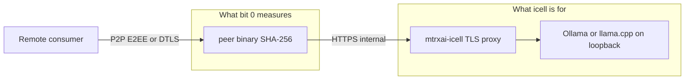
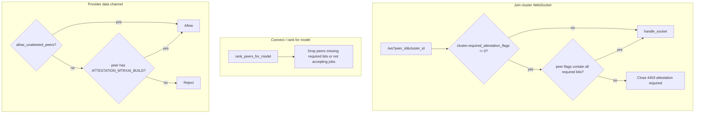
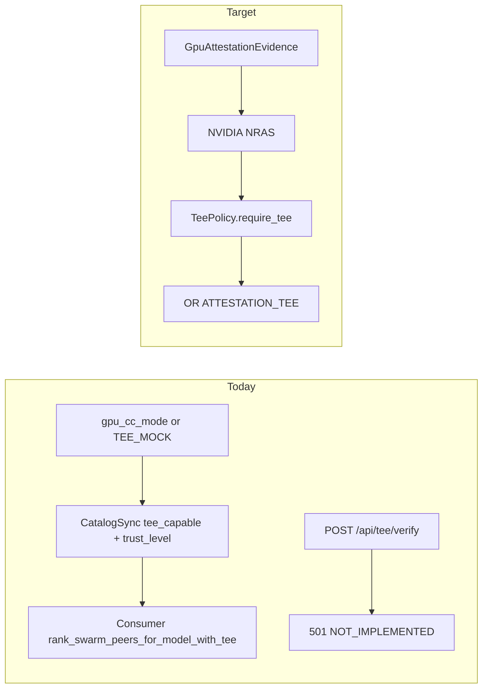

# mtrxAI attestation

This document is the detailed reference for **how mtrxAI proves that a node is running approved software and (optionally) a sealed inference backend**. It decodes the runtime flux: release → allowlist → challenge → proof → flags → cluster enforcement.

Operator quick start (Docker peer + icell): [mtrxAI-infra/deploy/production/peer/README.md](../../mtrxAI-infra/deploy/production/peer/README.md).

Related:

| Document | Topic |
|----------|--------|
| [SECURITY_ARCHITECTURE.md](SECURITY_ARCHITECTURE.md) | Broader security model; §7–8 summarize attestation |
| [CONFIDENTIAL_INFERENCE.md](CONFIDENTIAL_INFERENCE.md) | GPU TEE / confidential VM layout |
| [SECURE_OLLAMA.md](SECURE_OLLAMA.md) | Hardened icell / vault layouts |
| [`mtrxai-attestation`](../../mtrxAI-common/mtrxai-attestation/src/lib.rs) | Build proof crypto + flag bits |
| [`mtrxai-tee-attestation`](../../mtrxAI-common/mtrxai-tee-attestation/src/lib.rs) | GPU CC policy (not wired into lobby verify yet) |

---

## 1. What attestation is for

mtrxAI lets strangers route inference to **your GPU**. Consumers and cluster operators need a better answer than “this hostname claims to run mtrxAI.”

Attestation answers three nested questions:

1. **Is this the official peer binary?** (not a patched proxy that steals prompts)
2. **Is the LLM engine a sealed cell, not a random Ollama on the host?** (icell)
3. **Is inference happening inside a GPU/CPU TEE?** (confidential computing)

Those map to a bitmask stored on each peer (`peers.attestation_flags`) and compared against what a cluster requires (`clusters.required_attestation_flags`).

---

## 2. Attestation levels (flag bits)

Defined in [`mtrxai-attestation`](../../mtrxAI-common/mtrxai-attestation/src/lib.rs):

| Bit | Constant | Value | Meaning | Status |
|-----|----------|-------|---------|--------|
| 0 | `ATTESTATION_MTRXAI_BUILD` | `1 << 0` (`1`) | Official **peer** binary: SHA-256 matches the lobby allowlist; Ed25519 proof over a one-time challenge | **Implemented** |
| 1 | `ATTESTATION_LLM_SERVER` | `1 << 1` (`2`) | Official **inference backend** (intended: sealed **icell** image / measurement) | **Reserved** — constant exists; lobby does not set this bit yet |
| 2 | `ATTESTATION_TEE` | `1 << 2` (`4`) | GPU (and optional CPU) **confidential computing** evidence | **Reserved** on the lobby bitmask; client-side TEE ranking exists |

`has_required_flags(peer, required)` is true when **every** bit in `required` is set on the peer. `required == 0` means “no policy” (any peer may join).

### UI and public clusters

- Creating a cluster with **“Require attested client builds”** sends `required_attestation_flags = 1` (bit 0 only). See `peer/ui/v2/index.html`.
- Migration [`002_attestation_policy.sql`](../../mtrxAI-server/server/migrations/002_attestation_policy.sql) sets bit `1` on **public** named clusters.

Combining bits (when LLM-server and TEE verification ship) is additive, for example `1 | 2 | 4 = 7`.

### Trust levels vs flag bits

Flag bits are **lobby policy** (who may register / join / be selected). Separately, swarm gossip advertises a **trust_level** string used for ranking:

| `trust_level` | Typical meaning | How it is chosen today |
|---------------|-----------------|------------------------|
| `tee_gpu` | NVIDIA Hopper+ CC + (intended) NRAS verify | Peer sets this when `gpu_cc_mode` or `MTRXAI_TEE_MOCK=1` |
| `host` | App E2EE + process/container split (sidecar or **icell**) | `MTRXAI_INFERENCE_SIDECAR=1` |
| `transport` | libp2p Noise / WebRTC DTLS only | Default if neither of the above |

See [`mtrxai-tee-attestation` `TeeTrustLevel`](../../mtrxAI-common/mtrxai-tee-attestation/src/gpu.rs) and [CONFIDENTIAL_INFERENCE.md](CONFIDENTIAL_INFERENCE.md).

These two systems are **not fully unified** yet: a peer can gossip `tee_gpu` without the lobby `ATTESTATION_TEE` bit being set.

---

## 3. Why icell is needed

**Binary attestation (bit 0) only measures the peer executable.** After a request is decrypted (or received over DTLS), the peer forwards it to an LLM engine. If that engine is a host-installed Ollama with `:11434` on the LAN:

- A modified engine can log prompts and completions.
- Weights can be swapped without the peer binary changing (hash still matches).
- Operators can attach a debugger to a writable, shell-equipped container.

**Icell** (inference cell) is the sealed LLM sidecar the attested peer is supposed to talk to:

| Property | Why it matters for attestation |
|----------|--------------------------------|
| Separate published image (`mtrxai/mtrx-icell-ollama`, `mtrxai/mtrx-icell-llamacpp`) | A second measurement target — same allowlist *idea* as the peer (`ATTESTATION_LLM_SERVER`) |
| Engine bound to loopback inside the cell | Host and other containers cannot speak raw Ollama/llama.cpp |
| Read-only root, dropped capabilities, no shell in the image | Shrinks the attack surface of “official inference software” |
| HTTPS `:8443` only (`/mtrxai/v1/...`) | Model pull/load goes through a small admin API (`CELL_ADMIN_TOKEN`), not an open engine |
| Peer env `MTRXAI_INFERENCE_CELL_URL=https://ollama:8443` | Production compose **forces** the attested peer onto the cell, not a host daemon |

So: **peer attestation without icell** proves “this is our proxy.” **Peer + icell** is the deployable story for “this proxy only talks to a sealed engine.” Full **LLM-server attestation** (bit 1) will prove the *cell image* itself the way bit 0 proves the *peer* binary.

Until bit 1 is wired, running [production peer compose](../../mtrxAI-infra/deploy/production/peer/docker-compose.yml) is the operational equivalent: Hub images + internal-only engine + attested peer (`MTRXAI_ATTESTATION_SKIP=0`).



Icell does **not** replace TEE: a hostile host root can still inspect container memory. That is why bit 2 / `tee_gpu` sits above `host` trust. See [SECURITY_ARCHITECTURE.md §12](SECURITY_ARCHITECTURE.md#12-deep-dive-secure-provider-stack--optional-inference-sidecar).

---

## 4. Actors and artifacts

| Actor | Role |
|-------|------|
| **Release CI** (`mtrxAI-peer` Release workflow) | Builds peer with embedded `MTRXAI_BUILD_ID` + `MTRXAI_ATTESTATION_SECRET`; hashes the binary; writes `allowed_build.json` |
| **Infra CI** (`publish-allowlist.yml`) | Downloads manifests; `POST /api/admin/builds` on the production lobby |
| **Lobby** | Issues challenges; verifies proofs; stores flags; enforces cluster policy |
| **Peer process** | Hashes **its own** running exe; signs claims with the **embedded** seed; registers |
| **Icell** | Inference backend; not part of bit-0 hashing today |

**`allowed_build.json`** (one row per platform/build):

- `build_id` (UUID, also compiled into the binary)
- `binary_sha256`
- `public_key` (Ed25519 verifying key derived from the same 32-byte seed as `MTRXAI_ATTESTATION_SECRET`)
- `version`, `git_sha`, `platform` (`linux/x86_64`, … — Docker `amd64` is normalized)

The **signing seed must never ship in the allowlist**. Only the public key is stored in PostgreSQL (`allowed_builds`). The seed is a Docker/cargo **build-arg** baked into that specific binary.

---

## 5. Flux A — release and allowlist

This is how a build becomes eligible **before** any node boots.

```mermaid
sequenceDiagram
    autonumber
    participant Rel as Peer Release CI
    participant Hub as Docker Hub
    participant Inf as Infra publish-allowlist
    participant L as Lobby admin API
    participant DB as PostgreSQL allowed_builds

    Rel->>Rel: Generate BUILD_ID + ATTESTATION_SECRET
    Rel->>Rel: docker/cargo build with those as compile-time env
    Rel->>Rel: Extract /usr/local/bin/peer (or desktop binary)
    Rel->>Rel: SHA-256 file; derive public_key from seed
    Rel->>Rel: Write allowed_build.json
    Rel->>Hub: Push mtrxai/mtrx-peer:version
    Rel->>Inf: repository_dispatch (run_id / tag)
    Inf->>Rel: Download attestation-docker-* artifacts
    Inf->>L: POST /api/admin/builds (x-admin-key)
    L->>DB: INSERT/UPSERT allowed_builds
```

Scripts:

| Script | Does |
|--------|------|
| [`mtrxAI-peer/scripts/build-client-docker-attestation.sh`](../scripts/build-client-docker-attestation.sh) | Local attested image + extract binary |
| [`mtrxAI-peer/scripts/write-allowed-build-manifest.sh`](../scripts/write-allowed-build-manifest.sh) | Hash + `allowed_build.json` |
| [`mtrxAI-peer/scripts/register-allowed-build.sh`](../scripts/register-allowed-build.sh) | POST one manifest |
| [`mtrxAI-infra/scripts/fetch-client-attestation-manifests.sh`](../../mtrxAI-infra/scripts/fetch-client-attestation-manifests.sh) | Pull CI artifacts |
| [`mtrxAI-infra/deploy/production/peer/register-allowlist.sh`](../../mtrxAI-infra/deploy/production/peer/register-allowlist.sh) | Operator helper after a local attested build |

Revoke a compromised build: `POST` is insert; revoke is admin `…/builds/{build_id}` (see [`server/src/api/attestation.rs`](../../mtrxAI-server/server/src/api/attestation.rs)). After revoke, proofs with that `build_id` fail with `build has been revoked`.

---

## 6. Flux B — runtime challenge–response (bit 0)

This is the path that runs when a production peer starts with `MTRXAI_ATTESTATION_SKIP=0` and the lobby also requires proofs.

### 6.1 Peer: build a proof

Code: [`peer/src/attestation.rs`](../peer/src/attestation.rs), crypto: [`mtrxai-attestation`](../../mtrxAI-common/mtrxai-attestation/src/lib.rs).

1. If `MTRXAI_ATTESTATION_SKIP=1` → send **no** proof (lobby must skip or optional, or register fails).
2. If the binary has an empty embedded secret → refuse (not an official build).
3. `GET {lobby}/api/attestation/challenge`.
4. Hash **`std::env::current_exe()`** (the file on disk that is running).
5. Build `AttestationClaims`: challenge id, nonce, binary SHA-256, embedded `build_id` / version / git SHA, `OS/ARCH`, `issued_at`.
6. Canonical string (pipe-separated, **not** JSON):

   `{challenge_id}|{nonce}|{binary_sha256}|{build_id}|{version}|{git_sha}|{platform}|{issued_at}`

7. Sign with Ed25519 key from the embedded 32-byte seed. Attach Base64 signature → `AttestationProof`.

`peer/build.rs` injects `MTRXAI_BUILD_ID`, `MTRXAI_ATTESTATION_SECRET`, and `MTRXAI_GIT_SHA` at compile time. Changing the binary after build **breaks** the SHA-256 vs allowlist check even if the signature is valid.

### 6.2 Lobby: issue challenge

Code: [`server/src/attestation/challenge.rs`](../../mtrxAI-server/server/src/attestation/challenge.rs).

- Random 32-byte nonce, UUID `challenge_id`, TTL **60 seconds**, stored in `attestation_challenges`.
- Response nonce is Base64 of those bytes.

### 6.3 Lobby: verify on register

Code: [`server/src/attestation/verify.rs`](../../mtrxAI-server/server/src/attestation/verify.rs), [`api/peers.rs`](../../mtrxAI-server/server/src/api/peers.rs).

```mermaid
sequenceDiagram
    autonumber
    participant P as Peer
    participant L as Lobby
    participant DB as PostgreSQL

    P->>L: GET /api/attestation/challenge
    L->>DB: INSERT challenge (60s, unused)
    L-->>P: challenge_id, nonce, expires_at

    Note over P: SHA-256 current_exe<br/>Sign canonical claims with embedded seed

    P->>L: POST /api/peers/register { attestation: proof, … }
    alt Lobby MTRXAI_ATTESTATION_SKIP or OPTIONAL
        Note over L: Proof not required
    else Proof missing
        L-->>P: 401 attestation proof required
    end
    L->>DB: consume_challenge (one-shot; fail if expired/used)
    L->>L: nonce must match stored bytes
    L->>DB: get_allowed_build(build_id)
    L->>L: not revoked; SHA-256 equal; platform alias match
    L->>L: Ed25519 verify(claims, signature, allowlist public_key)
    L->>DB: register_peer (identity / service)
    L->>DB: OR attestation_flags with bit 0
    L-->>P: peer_id, service_id, …
```

Verification failures (all `401`):

| Message | Cause |
|---------|--------|
| `attestation proof required` | No proof and lobby is strict |
| `challenge invalid, expired, or already used` | Replay or >60s |
| `challenge nonce mismatch` | Proof not bound to this challenge |
| `build_id not on allowlist` | Unknown or never published build |
| `build has been revoked` | Admin revoke |
| `binary hash does not match allowlist` | Patched/replaced binary |
| `platform does not match allowlist` | e.g. amd64 row vs aarch64 process |
| `signature verification failed` | Wrong seed or claims tampered |

On success, `or_peer_attestation_flags(..., ATTESTATION_MTRXAI_BUILD)` **ORs** bit 0 onto `peers.attestation_flags`. Re-register with a valid proof keeps or sets that bit; skipping proof does not add it.

### 6.4 Lobby env knobs

| Variable | Effect |
|----------|--------|
| `MTRXAI_ATTESTATION_SKIP=1` | Proof not required; WS session-token extras from older designs are not the current gate |
| `MTRXAI_ATTESTATION_OPTIONAL=1` | Proof optional; if present it is still verified |
| (unset both) | Proof **required** on `POST /api/peers/register` |

Production peer compose sets `MTRXAI_ATTESTATION_SKIP=0` on the **peer**. The **lobby** must not skip if you want bit 0 to mean anything.

Dev stack sets skip on both sides so local builds can register.

---

## 7. Flux C — cluster and job enforcement

Bit 0 only helps if clusters **use** the flags.



| Checkpoint | Code |
|------------|------|
| WS connect | [`server/src/ws/handler.rs`](../../mtrxAI-server/server/src/ws/handler.rs) — close **4403** if flags insufficient |
| Provider selection | [`server/src/peers/connect_request.rs`](../../mtrxAI-server/server/src/peers/connect_request.rs) `eligible_peers` |
| Local WebRTC policy | [`peer/src/webrtc_manager.rs`](../peer/src/webrtc_manager.rs) `peer_connection_allowed` |

Swarm mode does **not** use lobby `required_attestation_flags` the same way; TEE filtering is `rank_swarm_peers_for_model_with_tee` when `MTRXAI_REQUIRE_TEE=1`.

---

## 8. Flux D — intended LLM-server / icell attestation (bit 1)

**Not implemented on the lobby.** Planned shape (so operators understand why production compose still ships icell):

```mermaid
sequenceDiagram
    participant CI as Icell Release CI
    participant P as Attested peer
    participant Cell as Icell container
    participant L as Lobby

    CI->>CI: Build mtrx-icell-* image; record image digest / cell binary hash
    CI->>L: Allowlist cell measurement (future admin API)
    P->>Cell: GET /mtrxai/v1/info (+ optional attestation quote)
    Cell-->>P: backend, version, measurement
    P->>L: Register or refresh flags with LLM-server proof
    L->>L: Verify cell measurement like binary proof
    L->>L: OR ATTESTATION_LLM_SERVER
```

Until then:

- Use Hub icell images pinned in `.env`.
- Keep the engine off the host network (current compose).
- Do not treat bit 0 as “the GPU stack is unmodified.”

---

## 9. Flux E — GPU TEE (bit 2 / `tee_gpu`)

**Implemented on the client for gossip and ranking; lobby verify is stubbed.**



Crate: [`mtrxai-tee-attestation`](../../mtrxAI-common/mtrxai-tee-attestation/). `GpuAttestationVerifier` talks conceptually to `https://nras.attestation.nvidia.com/v4/attest/gpu`; live HTTP verify is still a stub except `MTRXAI_TEE_MOCK=1`.

Confidential layout (icell inside TDX/SEV-SNP + H100 CC): [CONFIDENTIAL_INFERENCE.md](CONFIDENTIAL_INFERENCE.md).

---

## 10. What attestation does *not* prove

- The operator is honest (they control the host unless you are in a real TEE).
- Models on disk match a catalog (weights are not in the peer hash).
- Prompts are unseen by the provider process (use E2EE + sidecar/icell/`host` or TEE).
- Desktop/dev binaries without an embedded secret (they cannot pass a strict lobby).

Peer **device auth** (Ed25519 per `peer_id` on WebSocket) is a **different** protocol (`mtrxai-attestation::peer_auth`). It proves possession of the device key, not the build.

---

## 11. Operator checklist (production Docker)

1. Install Docker: [Get Docker](https://docs.docker.com/get-docker/).
2. Run [peer + icell compose](../../mtrxAI-infra/deploy/production/peer/README.md) with Hub images (`mtrxai/mtrx-peer`, `mtrxai/mtrx-icell-ollama`).
3. Keep `MTRXAI_ATTESTATION_SKIP=0` on the peer.
4. Confirm the lobby allowlist contains this image’s `build_id` (infra publish job after each release).
5. Join clusters that require attested builds (public clusters typically require bit 0).
6. Leave icell on the internal network; do not publish engine `:11434`.

If registration fails with `build_id not on allowlist`, the image is custom or the allowlist job did not run. See peer startup log in `attestation.rs`.

---

## 12. Code index

| Path | Role |
|------|------|
| `mtrxAI-common/mtrxai-attestation/src/lib.rs` | Claims, sign/verify, flag bits |
| `mtrxAI-common/mtrxai-attestation/src/peer_auth.rs` | Device WS auth (not build attestation) |
| `mtrxAI-common/mtrxai-tee-attestation/` | GPU policy + trust levels |
| `mtrxAI-peer/peer/src/attestation.rs` | Challenge fetch + proof |
| `mtrxAI-peer/peer/build.rs` | Embed build id + seed |
| `mtrxAI-server/server/src/attestation/` | Challenge + verify |
| `mtrxAI-server/server/src/api/attestation.rs` | HTTP challenge + admin builds |
| `mtrxAI-server/server/src/api/tee.rs` | 501 stub |
| `mtrxAI-server/server/src/db/attestation.rs` | Challenges + allowlist SQL |
| `mtrxAI-icell/docker/Dockerfile` | Sealed cell image |
