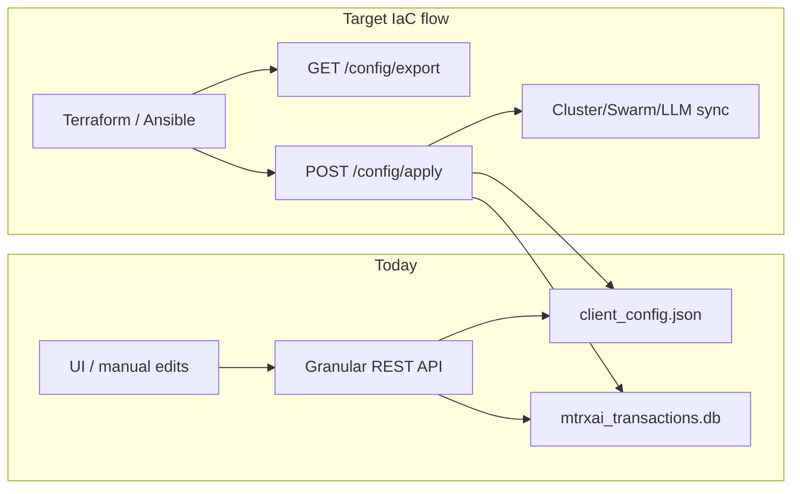
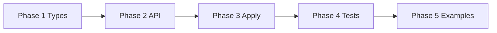

# Client Config Export/Import — Infrastructure as Code

Export and import the full mtrxAI client peer configuration as a versioned JSON document, so peers can be managed declaratively from Terraform, Ansible, or other automation tools.

See [SWARM_MODE.md](SWARM_MODE.md) for cluster/swarm membership fields and [client/src/client_config.rs](../client/src/client_config.rs) for the underlying `ClientConfig` types.

| Document | Topic |
|----------|-------|
| [NEXT_FEATURES.md](NEXT_FEATURES.md) | Roadmap index |
| This file | Config IaC plan and todos |
| [SWARM_MODE.md](SWARM_MODE.md) | Swarm mode config schema |

---

## Implementation todos

- [ ] **config-iac-types** — Create `client/src/config_iac.rs` with `mtrxAIClientConfigDocument`, `ApplyOptions`, export/apply/reconcile logic, and env ref resolution
- [ ] **api-endpoints** — Add `GET /api/client/config/export` and `POST /api/client/config/apply` handlers in `client/src/api/mod.rs`
- [ ] **tx-store-batch** — Add batch API key and blocked-peer helpers in `tx_db` for apply
- [ ] **runtime-sync** — Wire apply to `save_client_config`, LLM registry sync, and cluster/swarm connect-disconnect orchestration
- [ ] **validation** — Add schema validation on apply and startup warnings in `load_client_config`
- [ ] **tests** — Add roundtrip, identity, `dry_run`, and secret-ref tests
- [ ] **docs-examples** — Add minimal Ansible/Terraform examples under `examples/iac/`

---

## Current state

Configuration is already persisted as `ClientConfig` in `client_config.json`, but there is **no bulk export/import API**. Secrets are split across:

- **JSON file**: clusters, swarms, LLM servers, settings, `p2p_token`, `session_token`
- **SQLite** (`mtrxai_transactions.db`): encrypted LLM API keys, blocked peers

Individual REST endpoints in `client/src/api/mod.rs` mutate one resource at a time. This is unsuitable for Terraform/Ansible without a declarative apply endpoint.



---

## Target: versioned config document

Introduce a wrapper type (new module `client/src/config_iac.rs`) separate from runtime `ClientConfig` so we can add IaC metadata without breaking existing file load/save.

```json
{
  "schemaVersion": 1,
  "kind": "mtrxAI.client.config",
  "exportedAt": "2026-06-25T12:00:00Z",
  "config": {
    "p2pMode": "both",
    "lobbyHost": "127.0.0.1:8080",
    "setupComplete": true,
    "clusters": [
      {
        "clusterId": "…",
        "name": "europe",
        "visibility": "public",
        "connected": false,
        "acceptingJobs": false
      }
    ],
    "swarms": [
      {
        "swarmId": "…",
        "name": "prod-mesh",
        "p2pTokenRef": "env:P2P_TOKEN",
        "bootnodes": [],
        "connected": true,
        "acceptingJobs": true
      }
    ],
    "llmServers": [
      {
        "id": "…",
        "kind": "ollama",
        "url": "http://127.0.0.1:11434",
        "attached": true,
        "order": 0,
        "source": "manual",
        "advertiseToCluster": true,
        "models": []
      },
      {
        "id": "…",
        "kind": "custom",
        "url": "https://api.example.com/v1",
        "apiKeyRef": "env:OPENAI_API_KEY",
        "apiType": "chat-completions",
        "attached": true,
        "models": [{ "id": "gpt-4o", "name": "GPT-4o" }]
      }
    ],
    "settings": {
      "autoApproveRunModelRequest": false,
      "defaultNumPredict": 4096,
      "defaultNumCtx": 8192
    },
    "blockedPeers": [
      { "peerId": "…", "reason": "abuse" }
    ]
  },
  "identity": {
    "peerId": "…",
    "serviceId": "…",
    "sessionTokenRef": "env:MTRXAI_SESSION_TOKEN"
  }
}
```

### Scope boundaries

| Included in export/apply | Excluded (runtime-only) |
|---|---|
| Clusters/swarms with `connected` + `acceptingJobs` | Live connection counts, GPU probe, credit balance |
| LLM server definitions, attach/detach, custom models | Ollama tag discovery (rebuilt on apply via `sync_from_config`) |
| Inference settings (`default_num_*`, auto-approve) | Currently loaded Ollama models (`load`/`unload`) |
| Blocked peer list | Transaction history |
| Optional identity block | `LlmServerView.connected`, `model_count` |

**Local models** = configured LLM backends (`llmServers`) plus custom model entries. Ollama models remain runtime-discovered after the server URL is attached; no new static model list is needed for v1.

### Design decisions

| Topic | Choice |
|---|---|
| Secrets | Redact values; support env var references (e.g. `"apiKeyRef": "env:OPENAI_API_KEY"`) |
| Identity on import | Default: preserve local `peer_id` / `service_id` / `session_token`; optional `replace_identity=true` for clone/restore |

---

## API endpoints

Add to `client/src/api/mod.rs`:

### `GET /api/client/config/export`

Query params:

| Param | Default | Behavior |
|---|---|---|
| `include_identity` | `false` | Include identity block with refs; never raw `session_token` |
| `include_blocked` | `true` | Include blocked peers from `TxStore` |
| `include_secrets` | `false` | If true, emit env refs; never emit plaintext secrets |

Response: `mtrxAIClientConfigDocument` JSON (pretty-printed).

Export logic:

1. Read in-memory `ClientConfig`
2. Map to document `config` section (camelCase serde)
3. For each LLM server with a stored API key: emit `"apiKeyRef": "env:MTRXAI_API_KEY_<SERVER_ID>"`
4. For each swarm: emit `"p2pTokenRef": "env:MTRXAI_P2P_TOKEN_<SWARM_ID>"` (or `env:P2P_TOKEN` when single-swarm)
5. Optionally include redacted identity (`peerId`, `serviceId`, `sessionTokenRef`)

### `POST /api/client/config/apply`

Request body: full document (or `config` section only for convenience).

Body/query flags:

| Flag | Default | Behavior |
|---|---|---|
| `mode` | `replace` | `replace` = declarative full desired state; `merge` = upsert by id, do not remove unlisted entries |
| `replace_identity` | `false` | Keep local identity unless explicitly overridden |
| `dry_run` | `false` | Validate + return diff plan without persisting |
| `connect` | `true` | Honor `connected` flags by starting/stopping cluster/swarm managers after apply |

Response:

```json
{
  "ok": true,
  "dryRun": false,
  "changes": {
    "clustersAdded": 1,
    "clustersUpdated": 0,
    "clustersRemoved": 0,
    "swarmsAdded": 0,
    "llmServersUpdated": 2,
    "apiKeysSet": 1,
    "blockedPeersSet": 3
  },
  "warnings": ["cluster europe: not connected (connected=false)"]
}
```

---

## Apply / reconcile implementation

Core function in `client/src/config_iac.rs`:

```rust
pub async fn apply_config_document(
    state: &ProxyState,
    doc: &mtrxAIClientConfigDocument,
    opts: ApplyOptions,
) -> Result<ApplyResult>;
```

Steps:

1. **Validate** — `schemaVersion == 1`, run existing validators (`validate_custom_server_entry`), reject unknown `p2pMode`/`apiType`, require cluster/swarm ids
2. **Resolve secrets** — helper `resolve_secret_ref("env:FOO")` reads env var; also accept inline `apiKey` / `p2pToken` for local dev with doc warning
3. **Identity merge** — if `!replace_identity`, strip incoming identity and preserve current `peer_id`, `service_id`, `session_token`
4. **Reconcile config** — build new `ClientConfig`:
   - `replace`: set arrays exactly as document specifies (remove missing clusters/swarms/servers)
   - `merge`: upsert by `cluster_id` / `swarm_id` / server `id`
5. **Persist secrets** — batch-write resolved API keys via new `TxStore::put_server_api_keys_batch` in `client/src/tx_db/secrets.rs`
6. **Persist blocked peers** — replace local block list when `blockedPeers` present (replace mode) or upsert (merge mode)
7. **Save + sync** — `save_client_config`, then reuse existing hooks:
   - `sync_registry_after_config_change` (LLM registry)
   - notify cluster/swarm managers (same paths as connect/disconnect/maintenance handlers today)
8. **Connection orchestration** — if `connect=true`:
   - `connected=false` → call existing disconnect logic per membership
   - `connected=true` → call existing connect logic
   - `accepting_jobs=false` → maintenance mode (already persisted flag)

Also improve **startup validation**: call the same validator used by apply inside `load_client_config()` and log errors instead of silently resetting to defaults (non-breaking: keep load tolerant, but surface warnings).

---

## Secret reference convention

| Secret | Export ref pattern | Resolve on apply |
|---|---|---|
| LLM API key | `env:MTRXAI_API_KEY_<SERVER_ID>` | `std::env::var` after stripping `env:` |
| Swarm P2P token | `env:MTRXAI_P2P_TOKEN_<SWARM_ID>` or `env:P2P_TOKEN` | same |
| Session token | `env:MTRXAI_SESSION_TOKEN` | same, only when `replace_identity=true` |

---

## Phased delivery



| Phase | Todo IDs |
|-------|----------|
| 1 Core types | `config-iac-types` |
| 2 REST API | `api-endpoints` |
| 3 Apply + sync | `tx-store-batch`, `runtime-sync`, `validation` |
| 4 Tests | `tests` |
| 5 Examples | `docs-examples` |

---

## Key files to create/modify

| File | Change |
|---|---|
| `client/src/config_iac.rs` | **New** — document types, export, apply, secret refs, validation |
| `client/src/lib.rs` | Register module |
| `client/src/api/mod.rs` | Routes + handlers for export/apply |
| `client/src/client_config.rs` | Shared validation helper; optional startup warning |
| `client/src/tx_db/mod.rs` | Batch blocked-peer replace/upsert |
| `client/src/tx_db/secrets.rs` | Batch API key write helper |
| `examples/iac/` | **New** — minimal Ansible/Terraform samples |

---

## Tests

Add unit/integration tests in `client/src/config_iac.rs` (or `client/tests/config_iac.rs`):

- Roundtrip export → apply (replace) preserves clusters/swarms/LLM entries and flags
- `replace_identity=false` keeps local peer id when doc carries different identity
- Env ref resolution sets API keys in tx store
- `dry_run` returns diff without mutation
- `connected=false` + `accepting_jobs=false` persisted correctly
- Invalid custom server rejected with 400

---

## Out of scope (v1)

- CLI subcommands (`client config export`) — REST is sufficient for Ansible/Terraform; can add later
- JSON Schema file generation / `$schema` URL hosting
- Cross-machine encrypted secret portability (keys are machine-bound today via hostname+identity in `secrets.rs`)
- Server-side (lobby) config export — this plan is **client peer config only**
