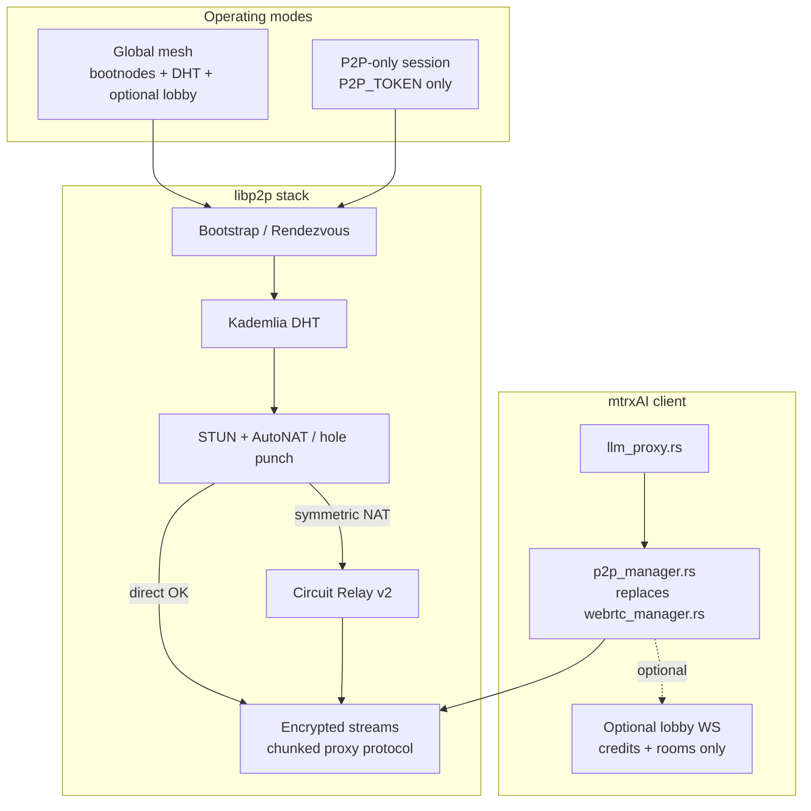
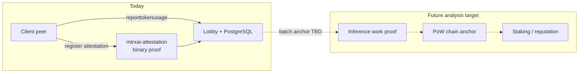

# mtrxAI — Planned Next Features

Roadmap notes for major upcoming capabilities. See [manifest.md](../manifest.md) for the broader vision and [README.md](../README.md) for what is implemented today.

| Document | Topic |
|----------|-------|
| This file | Roadmap index |
| [SWARM_MODE.md](SWARM_MODE.md) | Swarm network mode — libp2p P2P alongside Cluster |
| [CONFIG_IAC.md](CONFIG_IAC.md) | Client config export/import — Terraform/Ansible IaC |
| [A2A_INFERENCE.md](A2A_INFERENCE.md) | Agent-to-agent inference — analysis and implementation paths |
| [SECURE_OLLAMA.md](SECURE_OLLAMA.md) | Secure Ollama — mTLS shield, WSL2 hardening, Linux/Kata, macOS |
| This file (section 4) | PoW blockchain — on-chain inference attestation |

---

## 0. Client config export/import (IaC)

**Goal:** Export the full mtrxAI client peer configuration (clusters, swarms, LLM servers, settings, blocked peers, connected/disabled flags) as versioned JSON and apply it declaratively from Terraform, Ansible, or similar tools.

> **Implementation plan:** [CONFIG_IAC.md](CONFIG_IAC.md) — REST export/apply endpoints, env-var secret references, idempotent reconcile.

---

## 1. Model sharding / layer splitting

**Goal:** Run models too large for a single peer by splitting weights or compute across multiple nodes. A 70B (or larger) model becomes a **collective artifact** — clients still see one model name; mtrxAI routes activations through the shard pipeline.

### Approaches

| Strategy | What is split | Best when | Trade-off |
|----------|---------------|-----------|-----------|
| **Pipeline parallelism** | Transformer blocks by layer range (peer A: layers 0–15, peer B: 16–31, …) | Peers have similar bandwidth; latency tolerates sequential hops | Simple to reason about; latency grows with depth |
| **Tensor parallelism** | Individual weight matrices sharded across peers (e.g. column/row splits of attention/FFN) | Peers are co-located (same LAN / low RTT) | Lower per-token latency; needs tight sync and high bandwidth |
| **Hybrid** | Pipeline across groups, tensor parallel within a group | Mixed hardware (some fast local cluster + remote stragglers) | More scheduling complexity |

### How it could be implemented in mtrxAI

1. **Shard metadata in the catalog** — Extend the lobby `updatemodels` payload (and local peer registry) with shard descriptors, for example:
   - `logical_model`: `"llama-70b-sharded"`
   - `shard_role`: `"pipeline"` | `"tensor"`
   - `layer_start` / `layer_end` (pipeline) or `tp_rank` / `tp_world_size` (tensor)
   - `shard_group_id`: stable ID for peers that form one logical model

2. **Shard-aware routing** — Today [`client/src/llm_proxy.rs`](../client/src/llm_proxy.rs) picks a single remote peer via `getpeersformodel`. Sharded routing would:
   - Resolve a full **shard group** (all members required for inference)
   - Order pipeline peers by layer index; for tensor parallel, fan out/in within a stage
   - Fail over or reassemble if a shard peer drops (optional: hot standby shards)

3. **Activation transport** — Reuse the existing chunked proxy protocol ([`client/src/webrtc_manager.rs`](../client/src/webrtc_manager.rs), ~3 KiB JSON frames) or a dedicated binary stream for tensor payloads. Pipeline stages send hidden states + metadata (shape, dtype, step index) to the next peer.

4. **Inference backend** — Options, from simplest to most integrated:
   - **External runner** — Each peer runs a shard-aware engine (e.g. llama.cpp distributed / vLLM tensor parallel) behind a small local HTTP API; mtrxAI only orchestrates hops.
   - **Native shard executor** — New client module loads only assigned layers (GGUF slice or safetensors range) and runs forward for that slice.
   - **Coordinator peer** — One peer in the group owns the Ollama-facing `/api/chat` entry point and drives the multi-hop forward pass.

5. **Economics** — Token settlement splits credits across all shard providers proportionally (by layer count, FLOPs estimate, or fixed shard rate table in `service_model_rates`).

### Minimal first milestone

Pipeline-parallel **two-peer** split: peer A runs embedding + first half of layers, peer B runs second half + LM head. Single consumer request, two-hop activation relay, one logical model name in the room catalog. Validates routing, transport, and multi-party credit reporting before scaling to N shards or tensor parallel.

---

## 2. Replace WebRTC with libp2p

> **Implementation plan:** [SWARM_MODE.md](SWARM_MODE.md) — Swarm mode is Phase 1 of this migration (libp2p for Swarm; Cluster stays on WebRTC until later).

**Goal:** Move P2P transport and discovery from WebRTC (with lobby-mediated SDP signaling) to [libp2p](https://libp2p.io/), while supporting two deployment modes:

| Mode | Central server | Discovery | Use case |
|------|----------------|-----------|----------|
| **Global mesh** | Optional lobby for credits, rooms, dashboard | libp2p bootnodes + Kademlia DHT | Public or org-wide mtrxAI network |
| **P2P-only session** | Bypassed | Shared `P2P_TOKEN` only | Direct ad-hoc sessions; no lobby required |

Inference payloads continue to flow **peer-to-peer**; the lobby (when used) remains coordination and accounting only — not a data plane.

### Why libp2p

WebRTC works well for browser signaling but ties mtrxAI to SDP exchange through the lobby WebSocket. libp2p provides a unified Rust stack (`rust-libp2p`) for peer identity, multi-transport connectivity, NAT traversal, relay fallback, and encrypted streams — the same foundation used by IPFS, BitTorrent, and LocalAI-style P2P deployments.

### P2P discovery on the Internet

Unlike a LAN (multicast/broadcast), Internet nodes sit behind routers, firewalls, and NAT. Two mtrxAI peers anywhere in the world should find each other using only a shared **`P2P_TOKEN`** (or room-derived token). libp2p solves this in layers:

#### 1. Landing nodes — Rendezvous and bootnodes

A new node knows no peers initially. It needs stable entry points with public, reachable addresses.

- **Bootnodes** — mtrxAI ships (or configures) a list of bootstrap nodes with static public IPs.
- **Rendezvous protocol** — On startup with a `P2P_TOKEN`, the node connects to a bootnode and registers: *“I am node X, reachable at these addresses, and I have this token.”*
- **Blind rendezvous** — A second node with the **same token** queries the same bootnode: *“Who else has this token?”* The bootnode returns the first node’s dial addresses; the two peers then attempt a direct connection.

Bootnodes are only needed for the first moments of a node’s life.

#### 2. Network map — Kademlia DHT

To avoid long-term dependence on central servers, the network quickly shifts to a **Kademlia DHT**.

- The `P2P_TOKEN` (or its hash) becomes the **content key** in the DHT.
- Every connected node stores a small slice of the global peer directory.
- If bootnodes go away, nodes ask neighbors: *“Who is closest to this key?”* Requests hop peer-to-peer until the matching peers are found.

Room-scoped discovery in global mode can use compound keys (e.g. `hash(room_id || p2p_token)`) so peers only find others in the same trust boundary.

#### 3. Firewall traversal — STUN and NAT hole punching

Knowing a peer’s address is not enough when both sides are behind home or office routers that block unsolicited inbound traffic.

- **STUN** — The node asks a public STUN server: *“What IP and port does the Internet see for me?”* (reflects the NAT-mapped endpoint.)
- **ICE / hole punching (AutoNAT)** — Once both sides know public endpoints, they **simultaneously** send packets to each other. Each router treats the flow as outbound-initiated and opens a path for bidirectional traffic → **direct connection**.

This succeeds in roughly **80%** of cases.

#### 4. Last resort — Circuit Relay (Relay v2 / TURN-like)

When hole punching fails — common with **symmetric NAT** (corporate networks, mobile 4G/5G) — direct connection is impossible.

- **Circuit Relay v2** — libp2p selects a third peer (or dedicated relay) with a fully public address to act as a **bridge**. Node A and Node B both connect to the relay; the relay forwards encrypted frames without terminating the crypto layer.
- **Privacy** — Payloads remain **end-to-end encrypted** (Noise/TLS 1.3 via libp2p’s security handshake). The relay sees ciphertext only; it cannot read prompts, responses, or tokens.

### Mapping to mtrxAI architecture

### Implementation outline

1. **New module** — `client/src/p2p_manager.rs` (or `libp2p_manager.rs`) replacing [`webrtc_manager.rs`](../client/src/webrtc_manager.rs):
   - `Swarm` with identity from existing `peer_id` in `peer_config.json`
   - Transports: TCP, QUIC (optional), WebSocket for browser-adjacent peers
   - Protocols: rendezvous + kad DHT + autonat + relay client + identify

2. **Preserve proxy protocol** — Keep `ProxyRequest` / `ProxyResponseChunk` / `Done` JSON framing over libp2p **stream** or **request-response** behaviour; minimal change to [`llm_proxy.rs`](../client/src/llm_proxy.rs) call sites.

3. **Configuration**
   - `P2P_TOKEN` or room-derived token for discovery key
   - `MTRXAI_BOOTNODES` — multiaddr list
   - `MTRXAI_P2P_MODE=global|direct|lobby-only` — global mesh vs session-only vs legacy WebRTC during migration
   - Optional STUN/relay multiaddrs (defaults to public libp2p infrastructure)

4. **Lobby role after migration**
   - **Global mode:** WebSocket retained for `reporttokenusage`, room membership, dashboard — **not** for SDP `route` messages.
   - **P2P-only mode:** No lobby connection; credits and catalog are local or out of scope for the session.

5. **Server changes** — [`server/src/ws/`](../server/src/ws/) signaling paths (`route` SDP relay) deprecated; optional REST endpoint to publish bootnode/rendezvous hints. Room isolation can move to DHT key namespaces.

6. **Migration** — Feature flag: run WebRTC and libp2p in parallel during transition; peers negotiate transport capability via identify protocol or lobby capability bit.

### Success criteria

- Two peers on different home networks connect with **only a shared `P2P_TOKEN`**, no lobby.
- Same peers can join the **global mtrxAI mesh** and still respect **room-scoped** discovery when connected to the lobby for credits.
- Existing Ollama/OpenAI proxy behaviour unchanged from the application’s perspective.
- Symmetric-NAT peers connect via relay with E2E encryption verified (relay cannot decrypt inference payloads).

---

## 3. Agent-to-agent (A2A) inference

**Goal:** Move beyond single-hop “agent asks for a model on a remote peer” to **explicit multi-agent coordination** — planners delegating subtasks, capability-based routing, and optional standards-based interop (e.g. [Google A2A](https://google.github.io/A2A/)).

### What exists today

- Cursor/VS Code agents hit the local mtrxAI proxy; [`agent_compat.rs`](../client/src/agent_compat.rs) normalizes payloads.
- Missing models route over WebRTC to a ranked peer (`GetPeersForModel` → chunked `ProxyRequest`).
- Rooms/clusters enforce trust boundaries; model start APIs can warm remote weights before agents need them.

This is **implicit** mesh sharing: multiple agents can use the same inference grid, but peers do not act as delegatable agent endpoints and provider peers do not re-route.

### Planned capabilities

| Capability | Purpose |
|------------|---------|
| **Capability registry** | Advertise skills (code review, vision, RAG) not only model names; `GetPeersForCapability` ranking |
| **Task envelopes** | Structured delegation: goal, context, budget, deadline; handoff and cancellation |
| **Orchestrator tools** | Planner agent tools: `infer`, `find_peer`, `start_model`, `delegate_to_agent` |
| **A2A gateway** (optional) | Agent cards + `tasks/send` on each client; map tasks to internal `ProxyRequestCommand` |
| **Multi-hop relay** | Provider without local model forwards with `hop_limit` / credit splitting across chains |

### Full analysis

See **[A2A_INFERENCE.md](A2A_INFERENCE.md)** for:

- Current request lifecycle and architecture diagram
- Gaps (no re-route, model-only discovery, pairwise credits)
- Implementation paths A–E (shared mesh → capability registry → orchestrator → A2A protocol → multi-hop)
- Recommended phase progression

### Minimal first milestone

**Capability-aware routing (Path B lite):** extend `updatemodels` with a `capabilities` array per peer, add `GetPeersForCapability` to the lobby protocol, and allow `llm_proxy` to resolve `delegate_to_capability` in the request body before falling back to model name. Validates catalog, ranking, and remote inference without a full orchestrator or A2A server surface.

---

## 4. PoW blockchain — on-chain inference attestation

**Goal:** Explore how mtrxAI can anchor inference-work proofs on a **Proof-of-Work** chain to support staking, reputation, and verifiable settlement — without replacing the current PostgreSQL credit ledger in the first phase.

Today, cross-peer inference settles off-chain: both peers send `reporttokenusage` and the lobby reconciles credits in PostgreSQL ([`server/src/db/credits.rs`](../server/src/db/credits.rs)). Client binary integrity is already attested via ed25519-signed proofs ([`mtrxai-attestation/src/lib.rs`](../mtrxai-attestation/src/lib.rs), verified in [`server/src/attestation/verify.rs`](../server/src/attestation/verify.rs)). The manifest’s compute-economy layer ([`manifest.md`](../manifest.md) Layer 2) describes future **credit staking** and slashing on provably bad inference — this section tracks analysis of whether and how a PoW chain anchors those proofs.

### Analysis areas (todo)

| Area | Questions to answer |
|------|---------------------|
| **What gets attested on-chain** | Map `TokenUsageReport` + dual `reporttokenusage` flow to a compact, anchorable proof (hash of `req_id`, peer IDs, token counts, model, timestamps) |
| **Relationship to existing attestation** | Client binary proofs (`AttestationProof`) vs inference-work proofs; extend `mtrxai-attestation` or introduce a separate proof type |
| **PoW chain connectivity** | JSON-RPC to full/light nodes; OP_RETURN / `OP_FALSE OP_RETURN` data carriers; merge-mined or sidechain patterns; L1 vs notarized checkpoints |
| **Staking and slashing model** | How manifest “credit staking” maps to on-chain collateral; dispute windows; sampling-based verification vs full replay |
| **Operational constraints** | Block time, fees, finality; whether PoW finality suits real-time billing vs periodic batch anchoring |
| **Rust integration surface** | New `server` module or crate (e.g. `bitcoincore-rpc`, chain-specific SDKs) — analysis only; no implementation yet |

### Chain candidates (open)

Bitcoin, Litecoin, Dogecoin, or a custom PoW sidechain — choice deferred until connectivity and data-carrier limits are evaluated.

### Minimal first milestone (analysis outcome)

Recommend one pattern — e.g. **periodic Merkle batch of settled `TokenUsageReport` rows anchored via OP_RETURN** — with explicit trade-offs vs full on-chain micropayments, and a clear boundary between off-chain settlement (PostgreSQL) and on-chain attestation (immutable anchor).

---

## 5. Secure Ollama (mTLS + platform hardening)

**Goal:** Protect inference end-to-end: P2P ciphertext (libp2p Noise + mtrxAI E2EE) decrypted only inside a hardened **inference vault** — one container on WSL2 (mtrxAI client + nginx mTLS + Ollama or llama.cpp), same layout inside a Kata microVM on Linux.

| Scenario | Platform | Approach |
|----------|----------|----------|
| **1** | Windows + WSL2 + GPU | **Unified inference vault** — loopback mTLS, ephemeral tmpfs certs, no published Ollama ports |
| **2** | Linux bare metal | Same vault image + Kata runtime + optional VFIO GPU passthrough |
| **3** | macOS | Native vault supervisor + mTLS; Apple GPU path TBD |

WSL2 vault is **safe against network attackers** and raises the bar for local users; it is **not** safe against a hostile Windows/WSL host admin (no hardware isolation). Use Kata for that threat model.

Also requires mtrxAI client changes: `MTRXAI_OLLAMA_TLS_*` env vars and rustls mTLS for the Ollama backend.

> **Implementation plan:** [SECURE_OLLAMA.md](SECURE_OLLAMA.md) — threat model, compose layouts, client mTLS wiring, implementation TODO.

Related: [CONFIDENTIAL_INFERENCE.md](CONFIDENTIAL_INFERENCE.md), [SECURITY_ARCHITECTURE.md](SECURITY_ARCHITECTURE.md) §17–18.

---

## References

- [manifest.md](../manifest.md) — vision layers (sharding, federated lobbies, privacy, agent swarm, compute economy)
- [SECURE_OLLAMA.md](SECURE_OLLAMA.md) — secure Ollama deployment (WSL2, Kata, macOS)
- [A2A_INFERENCE.md](A2A_INFERENCE.md) — agent-to-agent inference analysis
- [mtrxai-attestation/src/lib.rs](../mtrxai-attestation/src/lib.rs) — existing ed25519 signed-proof pattern for client attestation
- [server/src/db/credits.rs](../server/src/db/credits.rs) — off-chain token settlement data model today
- [LocalAI / libp2p P2P patterns](https://github.com/mudler/LocalAI) — rendezvous + DHT + relay stack used in similar deployments
- [rust-libp2p](https://github.com/libp2p/rust-libp2p) — Rust implementation target for the client
- [Google A2A protocol](https://google.github.io/A2A/) — optional standards-based agent coordination layer
