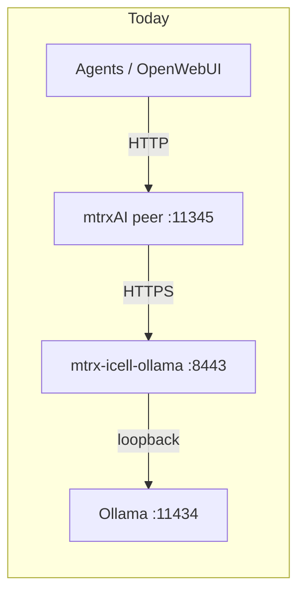
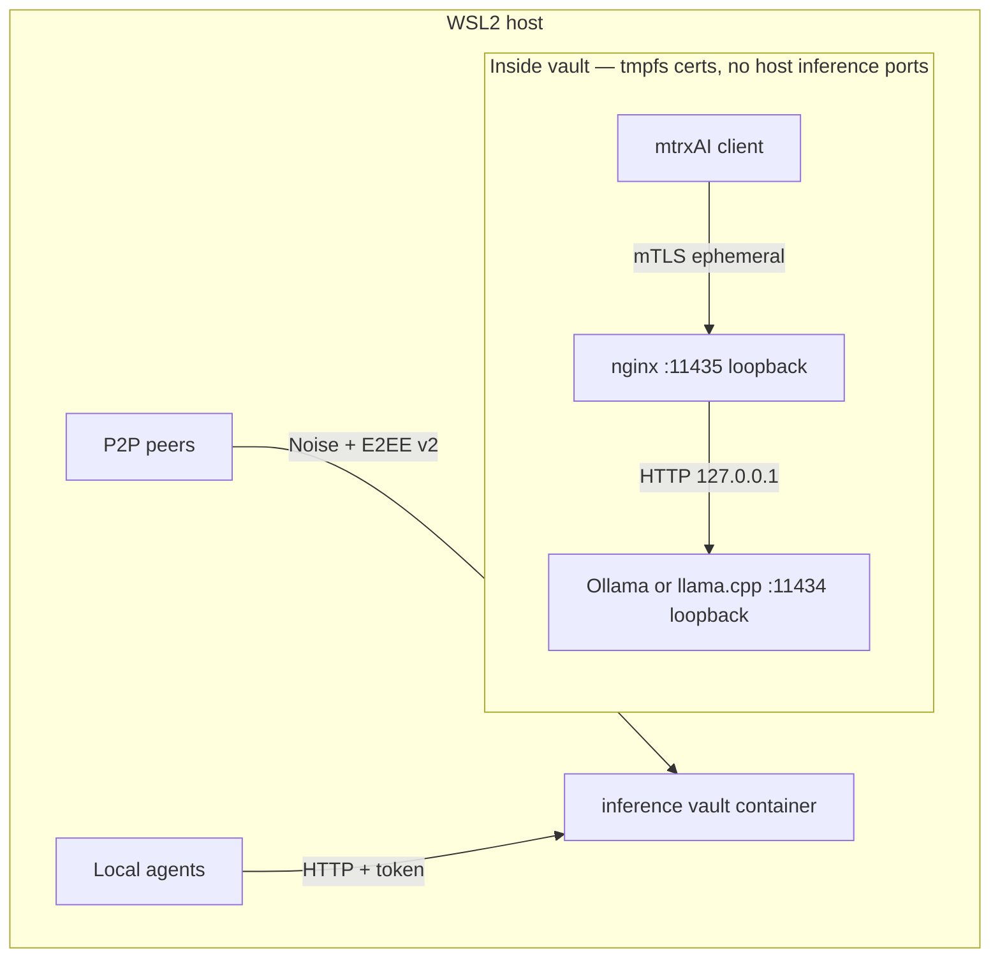
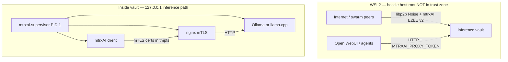

# Secure Ollama: WSL2, Linux/Kata, macOS

**Status:** Planned — roadmap index: [NEXT_FEATURES.md](NEXT_FEATURES.md) §5 · full plan below.

Optional secure-inference stacks that place an mTLS nginx shield between the mtrxAI peer and Ollama. Existing [`mtrxAI-infra/deploy/production/peer/`](../../mtrxAI-infra/deploy/production/peer/) compose is unchanged; hardened layouts live under `mtrxAI-infra/deploy/secure/`.

Related docs:

- [`CONFIDENTIAL_INFERENCE.md`](CONFIDENTIAL_INFERENCE.md) — swarm E2EE + inference sidecar trust tiers
- [`SECURITY_ARCHITECTURE.md`](SECURITY_ARCHITECTURE.md) — overall security model and §17 TLS backlog
- Hardened provider stack (peer + icell): `mtrxAI-infra/deploy/secure/client-icell/` — see [SECURITY_ARCHITECTURE.md §12](SECURITY_ARCHITECTURE.md#12-deep-dive-secure-provider-stack--optional-inference-sidecar)

---

## Current baseline

Today the production peer stack ([`mtrxAI-infra/deploy/production/peer/docker-compose.yml`](../../mtrxAI-infra/deploy/production/peer/docker-compose.yml)) runs:

- **Sealed icell** (`docker.io/mtrxai/mtrx-icell-ollama`) on HTTPS `:8443` (Ollama engine loopback-only inside the cell)
- **mtrxAI peer** calling `https://ollama:8443` via `MTRXAI_INFERENCE_CELL_URL`
- Engine port `:11434` is **not** published to the host



### Target boundary (all scenarios)

**WSL2 (recommended):** one hardened **inference vault** container — mtrxAI client + nginx + Ollama or llama.cpp. P2P ciphertext enters the vault; decryption and local mTLS stay inside a single network namespace.



**Linux Kata:** same logical layout inside a microVM; host root cannot read guest RAM.

**Design principles:**

- Ollama / llama.cpp bind **127.0.0.1 only** — never published to the host.
- mTLS certs generated at container start into **tmpfs** — never on host disk or in the image.
- Publish only **P2P** (and optionally the mtrxAI HTTP proxy with `MTRXAI_PROXY_TOKEN`) — not `:11434` / `:11435`.

---

## Repo layout (separate optional stacks)

| Path | Purpose |
|------|---------|
| `dockercompose/secure/wsl2/` | WSL2 + GPU — **unified inference vault** (recommended) |
| `dockercompose/secure/linux-kata/` | Bare-metal Linux + Kata runtime + optional VFIO GPU |
| `dockercompose/secure/macos/` | Placeholder compose/scripts + GPU evaluation notes |
| `dockercompose/secure/common/` | Shared `nginx.conf`, supervisor entrypoint, `.env.example` |
| `scripts/secure-ollama/` | Host-side helpers: `gen-certs.sh`, `start-wsl2.sh`, `start-kata.sh` |

---

## Scenario 1 — Windows + WSL2 + GPU (unified inference vault)

On WSL2 we **cannot** isolate hardware from a Windows/WSL host admin. The best practical design is a **single hardened container** that holds the full inference path: mtrxAI client, nginx mTLS shield, and Ollama or **llama.cpp** (`llama-server`). Nothing on the inference path is reachable from the host over the network except what you explicitly publish (P2P / optional mtrxAI proxy).

### Why one container (not three)

| | Three containers (legacy) | **Unified vault (recommended)** |
|--|---------------------------|----------------------------------|
| Ollama on Docker bridge | Plain HTTP between shield and engine | **Eliminated** — loopback only |
| Host network exposure | Must wire internal `ollama-net` | Single unit; only P2P/proxy ports published |
| Ephemeral certs | Shared tmpfs volume across services | Generated by vault supervisor at PID 1 |
| WSL2 realism | Same host-root limits | Same limits, **smaller network attack surface** |

Internal Client→nginx mTLS inside the same container is **not** a substitute for hardware isolation, but it still adds **process-layer** separation (a compromised Ollama process cannot trivially impersonate the mtrxAI client to nginx without the client key in tmpfs).

### Architecture



**Data flow for remote inference:**

1. Ciphertext arrives on libp2p (Noise transport + optional E2EE v2 envelope).
2. mtrxAI client decrypts **inside the vault** (or inference sidecar process in the same vault if `MTRXAI_INFERENCE_SIDECAR=1`).
3. Client calls `https://127.0.0.1:11435` with ephemeral client cert.
4. nginx verifies mTLS, proxies to `http://127.0.0.1:11434`.
5. Ollama / llama.cpp runs inference; response returns on the same path.

### Vault supervisor (PID 1)

Distroless has no shell — use a small static **`mtrxai-supervisor`** binary (Rust or C) as entrypoint:

1. Mount tmpfs at `/run/mtrxai/certs`.
2. Generate CA + nginx + client certs in memory (**never write to host disk**).
3. Start inference backend (`ollama serve` or `llama-server`) on `127.0.0.1:11434`.
4. Start nginx with mTLS on `127.0.0.1:11435`.
5. Start mtrxAI client with `MTRXAI_OLLAMA_HOST=https://127.0.0.1:11435` and cert paths under tmpfs.
6. Reap zombies; rotate certs on `SIGHUP` or periodic restart.

| Backend | When to use |
|---------|-------------|
| **Ollama** | Default; matches existing mtrxAI compose and `/api/*` paths |
| **llama.cpp** (`llama-server`) | Smaller image, more control; same nginx→HTTP pattern on `:11434` |

### Host hardening (compose)

```yaml
# Single service: mtrxai-inference-vault
read_only: true
cap_drop: [ALL]
security_opt: [no-new-privileges:true]
tmpfs:
  - /tmp
  - /run/mtrxai/certs:rw,noexec,nosuid,size=16m
  - /var/cache/nginx:rw,noexec,nosuid,size=8m
  - /var/run:rw,noexec,nosuid,size=1m
gpus: all
ports:
  - "${MTRXAI_P2P_LISTEN_PORT:-4001}:4001"
  - "${MTRXAI_PROXY_PORT:-11345}:11345"   # optional; use MTRXAI_PROXY_TOKEN
# NO publish for 11434 or 11435
volumes:
  - ollama_models:/models
```

No `--privileged`, no Docker socket mount, no `network_mode: host` for the inference path.

### Is this safe?

**Short answer:** **Safe enough for WSL2 against network attackers and casual local users** — **not safe against a hostile WSL2/Windows host administrator.**

| Adversary | Protected? | Why |
|-----------|------------|-----|
| Remote peer without E2EE keys | **Yes** | libp2p Noise + mtrxAI E2EE v2 |
| LAN port scanning | **Yes** | Ollama/mTLS not published |
| Non-root user on same WSL instance | **Mostly** | No shell; no inference ports |
| **WSL2 / Windows root or admin** | **No** | overlay2, `docker cp`, memory inspection — no HW boundary |
| `docker cp` of tmpfs certs while running | **Partially** | Short TTL + restart; not crypto alone |
| Compromised Ollama only | **Partially** | mTLS + loopback limits lateral movement |

**Trust tier on WSL2:** `transport` (strong) + **partial** `host`.

| Claim | Achievable on WSL2? |
|-------|---------------------|
| Host cannot **network-connect** to Ollama/nginx mTLS | **Yes** |
| Host cannot `docker exec` a shell | **Yes** (distroless) |
| Host root cannot **ever** read prompts or keys | **No** — use Kata (Scenario 2) |

**Verdict:** Software hardening, not confidential computing. Right design when the threat model is *protect on the wire and from other users; machine owner is trusted or out of scope.*

### Alternative: three-container layout

Split services only if you need independent Ollama restarts. Does **not** improve WSL2 host-root resistance and leaves plain HTTP on the Docker bridge.

### WSL2 mtrxAI wiring (inside vault)

- `MTRXAI_OLLAMA_HOST=https://127.0.0.1:11435`
- `MTRXAI_OLLAMA_TLS_*` → `/run/mtrxai/certs` (tmpfs)
- `MTRXAI_E2EE_ENABLED=1`, optional `MTRXAI_INFERENCE_SIDECAR=1`, `MTRXAI_PROXY_TOKEN`
- WSL2 GPU: `/usr/lib/wsl` volume + `LD_LIBRARY_PATH` on vault service

### Manual cert generation (reference)

For local testing outside compose cert-init:

```bash
mkdir -p certs && cd certs
openssl req -x509 -nodes -newkey rsa:4096 -keyout ca.key -out ca.crt -days 365 -subj "/CN=Internal-CA"
openssl req -nodes -newkey rsa:2048 -keyout ollama-proxy.key -out ollama-proxy.csr -subj "/CN=ollama-proxy"
openssl x509 -req -in ollama-proxy.csr -CA ca.crt -CAkey ca.key -CAcreateserial -out ollama-proxy.crt -days 365
openssl req -nodes -newkey rsa:2048 -keyout client.key -out client.csr -subj "/CN=app-client"
openssl x509 -req -in client.csr -CA ca.crt -CAkey ca.key -CAcreateserial -out client.crt -days 365
chmod 600 *.key && chmod 644 *.crt
```

---

## Scenario 2 — Linux bare metal + Kata Containers (hardware isolation)

Use when the threat model includes **host root** and memory inspection. Kata runs each container in a QEMU microVM; combine with Scenario 1 mTLS for defense in depth.

### Host prerequisites (operator-run)

1. **IOMMU / VFIO** — bind dedicated GPU via `vfio-pci.ids=…` in GRUB (`intel_iommu=on iommu=pt`)
2. **Install Kata** — register `kata-runtime` in `/etc/docker/daemon.json`
3. **Kata config** — `enable_passthrough_attributes = true`, tune `memory_offset` for GPU
4. **Harden kata-agent** — `enable_guest_seccomp = true`, `close_console_on_exit = true` where policy allows

Example Docker runtime registration:

```json
{
  "runtimes": {
    "kata-containers": {
      "path": "/usr/bin/kata-runtime"
    }
  }
}
```

### Compose/runtime

Same **unified vault** image as WSL2, run with Kata runtime:

```yaml
runtime: kata-containers
devices:
  - /dev/vfio/vfio
  # plus VFIO group devices per host setup
```

Inside the microVM, layout is identical (supervisor + client + nginx + Ollama/llama.cpp on loopback). Host root **cannot** read guest RAM — this is where “non accessible from the host” becomes **meaningful**.

### Trust tier alignment

| Tier | WSL2 unified vault | Linux Kata vault | Linux Kata + H100 CC CVM |
|------|-------------------|------------------|--------------------------|
| `transport` | yes | yes | yes |
| `host` | partial (software only) | yes | yes |
| `tee_gpu` | no | no (unless CC VM) | yes (future NRAS wiring) |

---

## Scenario 3 — macOS (GPU monitoring implemented; secure delivery TBD)

The mtrxAI client now probes Apple Silicon GPU stats locally via `ioreg` (`apple-ioreg` source): utilization, unified GPU memory, and chip identity. Implement the **mtrxAI ↔ Ollama mTLS boundary** first; secure GPU delivery path remains a separate research track.

### Phase A — mTLS boundary (platform-agnostic)

```
mtrxAI client  --mTLS-->  nginx shield :11435  --HTTP-->  Ollama :11434
```

Private keys: macOS Keychain or tmpfs — never checked into the repo.

### Phase B — GPU options to evaluate

| Option | GPU | Root read of proxy↔Ollama | Notes |
|--------|-----|---------------------------|-------|
| **Native Ollama + local nginx** | Metal (best) | TLS on loopback; root can attach debugger to processes | Likely best Mac GPU path |
| **Docker Desktop Linux VM** | Poor/none | Same as WSL2 software boundary | Not recommended for GPU |
| **Lima/Colima Linux VM** | Experimental | VM boundary + mTLS inside VM | Research spike |

**Interim default:** native Metal Ollama + launchd-managed nginx shield + mtrxAI desktop client at `https://127.0.0.1:11435` with client cert from Keychain-exported PEM.

Deliver under `dockercompose/secure/macos/`:

- nginx + cert-init scripts (`brew`/launchd)
- `.env.example` for native mtrxAI client
- GPU evaluation checklist (latency, model load, sidecar requirements; basic Metal stats via client `apple-ioreg` probe)

---

## mtrxAI client changes (mTLS to Ollama)

Today [`client/src/lib.rs`](../client/src/lib.rs) uses `reqwest::Client::new()` with no TLS identity.

### 1. Enable rustls on reqwest

```toml
reqwest = { version = "0.11", features = ["json", "stream", "rustls-tls"] }
```

### 2. TLS HTTP client factory

New module `client/src/security/tls_client.rs`:

| Env var | Purpose |
|---------|---------|
| `MTRXAI_OLLAMA_TLS_CA` | Path to CA cert for shield verification |
| `MTRXAI_OLLAMA_TLS_CERT` | Client certificate PEM |
| `MTRXAI_OLLAMA_TLS_KEY` | Client private key PEM |
| `MTRXAI_OLLAMA_TLS_INSECURE` | Dev only: skip CA verify (default off) |

### 3. Wire through LLM stack

Replace bare `Client::new()` in `lib.rs`, `llm_proxy.rs`, `llm_registry.rs`. When TLS env vars are set, seed `llm_servers[].url` as `https://ollama-shield:11435`.

### 4. Inference sidecar

Sidecar uses `forward_chat_stream()` on shared proxy state — one TLS-configured registry client covers sidecar mode automatically.

### 5. Tests

`client-tests/tests/ollama_mtls.rs` — gated on `MTRXAI_OLLAMA_MTLS_TEST=1`.

---

## Threat model summary

| Attack | WSL2 unified vault | Linux Kata vault |
|--------|-------------------|------------------|
| Network scan / LAN peer hits Ollama | blocked (not published) | blocked |
| P2P wire sniffing | blocked (Noise + E2EE) | blocked |
| `docker exec sh` | blocked (distroless) | blocked / redirected |
| `docker cp` keys from tmpfs while running | possible for host root | blocked or agent-gated |
| Host memory dump of plaintext prompts | possible | microVM RAM not mapped to host |
| Windows host admin | full WSL2 visibility | N/A |

---

## Implementation TODO

- [ ] **common-assets** — `dockercompose/secure/common/` (nginx.conf, supervisor stub, `.env.example`)
- [ ] **client-mtls** — `client/src/security/tls_client.rs`, `MTRXAI_OLLAMA_TLS_*` env wiring
- [ ] **wsl2-vault** — unified inference vault image (`mtrxai-supervisor` + client + nginx + Ollama or llama.cpp), tmpfs certs, no inference port publish
- [ ] **kata-stack** — `dockercompose/secure/linux-kata/` + VFIO/GPU host guide (same vault image, `runtime: kata-containers`)
- [ ] **macos-track** — native vault equivalent (launchd supervisor), GPU evaluation README
- [ ] **docs-tests** — update [`dockercompose/README.md`](../dockercompose/README.md), add `client-tests/tests/ollama_mtls.rs`

### Implementation order

1. Common assets — nginx.conf (loopback upstream), supervisor design, `.env.example`
2. Client mTLS — `tls_client.rs`, env wiring, tests
3. WSL2 unified vault — Dockerfile, `mtrxai-supervisor`, compose
4. Linux/Kata — same image + runtime + VFIO host guide
5. macOS native vault scripts
6. Cross-links in security architecture and compose README

---

## Out of scope (this iteration)

- Lobby-native CA / `MTRXAI_PROXY_TLS` (see `SECURITY_ARCHITECTURE.md` §17)
- Full NRAS GPU attestation wiring (`mtrxai-tee-attestation` workspace integration)
- Replacing default production client compose
- Distroless nginx build (nginx runs inside vault with hardening flags; optional minimal alpine only for dev)
- `mtrxai-supervisor` source crate (planned under `dockercompose/secure/common/supervisor/` or `client/supervisor/`)
