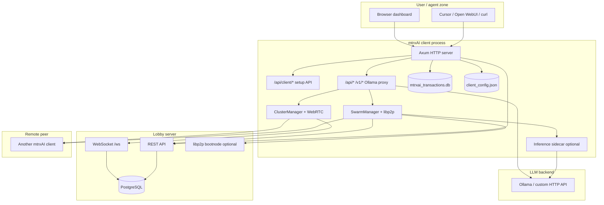
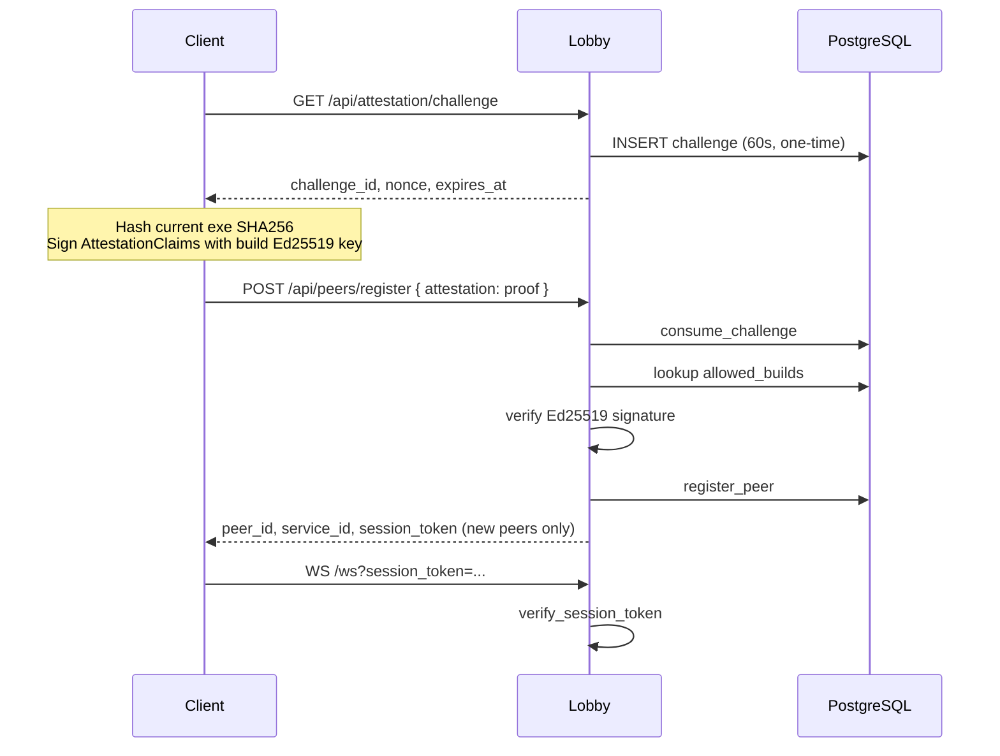
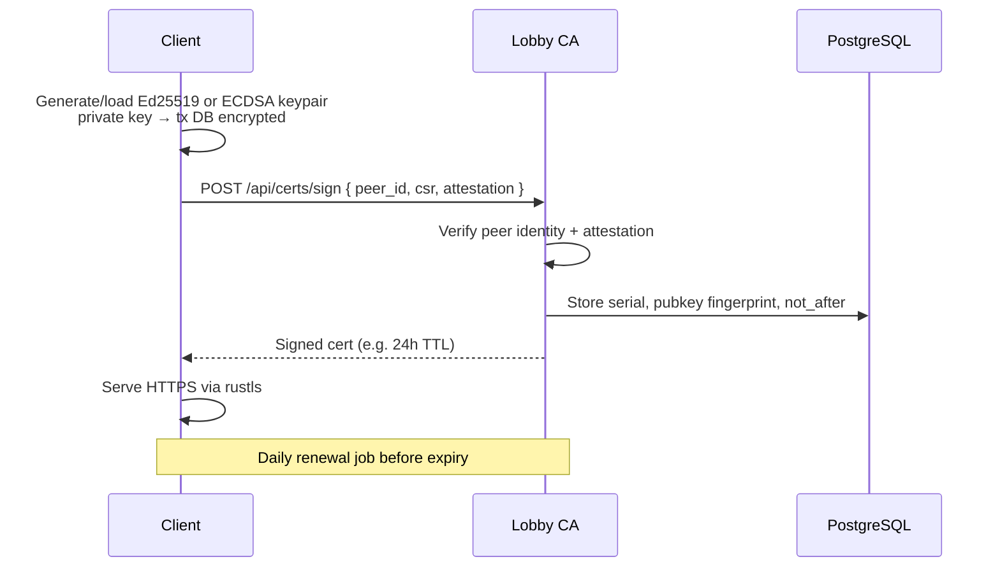

# mtrxAI Security & Communication Architecture

This document describes how mtrxAI components communicate today, where authentication and encryption happen, and known gaps with suggested improvements. It is intended for operators, security reviewers, and contributors planning hardening work (including TLS for client APIs and lobby-issued certificates).

**Related docs:** [CONFIDENTIAL_INFERENCE.md](./CONFIDENTIAL_INFERENCE.md), [SWARM_MODE.md](./SWARM_MODE.md), root [README.md](../README.md).

---

## Table of contents

1. [Executive summary](#1-executive-summary)
2. [Component overview](#2-component-overview)
3. [Communication topology](#3-communication-topology)
4. [Authentication & encryption matrix](#4-authentication--encryption-matrix)
5. [Deep dive: Lobby server](#5-deep-dive-lobby-server)
6. [Deep dive: Client](#6-deep-dive-client)
7. [Deep dive: Binary attestation (`mtrxai-attestation`)](#7-deep-dive-binary-attestation-mtrxai-attestation)
8. [Deep dive: GPU TEE attestation (`mtrxai-tee-attestation`)](#8-deep-dive-gpu-tee-attestation-mtrxai-tee-attestation)
9. [Deep dive: Application-layer E2EE (`client/src/crypto`)](#9-deep-dive-application-layer-e2ee-clientsrccrypto)
10. [Deep dive: Cluster mode (WebRTC)](#10-deep-dive-cluster-mode-webrtc)
11. [Deep dive: Swarm mode (libp2p)](#11-deep-dive-swarm-mode-libp2p)
12. [Deep dive: Inference sidecar](#12-deep-dive-inference-sidecar)
13. [Deep dive: Local storage & secrets](#13-deep-dive-local-storage--secrets)
14. [Deep dive: Desktop shell (Tauri)](#14-deep-dive-desktop-shell-tauri)
15. [Deep dive: Docker deployment](#15-deep-dive-docker-deployment)
16. [Deep dive: Credit & token settlement](#16-deep-dive-credit--token-settlement)
17. [Transport security: TLS and client certificates](#17-transport-security-tls-and-client-certificates)
18. [Improvement backlog](#18-improvement-backlog)

---

## 1. Executive summary

mtrxAI is a distributed LLM proxy network. A central **lobby server** handles signaling, peer directory, cluster metadata, and (in cluster mode) credit settlement. **Inference payloads** are intended to flow directly between peers over WebRTC (cluster) or libp2p (swarm), not through the lobby.

Security is layered but uneven:

| Layer | Status today |
|-------|----------------|
| Lobby HTTP/WS | Plaintext on `:8080`; optional binary attestation + HMAC session tokens |
| Client local HTTP | Plaintext; default bind `127.0.0.1`; optional bearer token on LLM routes |
| Cluster inference | WebRTC DTLS at transport; **plaintext JSON** on data channel |
| Swarm inference | libp2p Noise at transport; **ChaCha20-Poly1305 E2EE** on v2 protocol (default on) |
| GPU TEE trust | Client-side ranking only; server verify endpoint **disabled** |
| Production TLS | Documented as reverse-proxy responsibility, not built into binaries |

There is **no native HTTPS/TLS** on the lobby or client HTTP servers. P2P transports (Noise, WebRTC DTLS) encrypt their own wire format, but that is not the same as TLS on the management APIs.

---

## 2. Component overview

| Component | Path | Role | Listens / connects |
|-----------|------|------|-------------------|
| **Lobby server** | `server/` | REST API, WebSocket signaling, PostgreSQL, optional libp2p bootnode | `0.0.0.0:8080` HTTP/WS; optional `:4001`/`4010` libp2p |
| **CLI client** | `client/` | Ollama-compatible proxy, embedded dashboard, P2P managers | Default `127.0.0.1:11345` HTTP; WS to lobby; libp2p/WebRTC |
| **Desktop shell** | `desktop/` | Spawns `client::run()`, opens webview to local proxy | Same as client |
| **Binary attestation** | `mtrxai-attestation/` | Ed25519 challenge-response for allowlisted client builds | Used at register time |
| **GPU TEE attestation** | `mtrxai-tee-attestation/` | NVIDIA CC policy evaluation (not in workspace / server today) | Client gossip only |
| **PostgreSQL** | `server/migrations/` | Peers, services, credits, clusters, attestation allowlist | `:5432` |
| **Local tx DB** | `client/src/tx_db/` | SQLite-like native DB: transactions, keys, blocked peers | `mtrxai_transactions.db` |
| **Inference sidecar** | `client/src/inference_sidecar.rs` | Optional process split: P2P relay blind, sidecar decrypts | `127.0.0.1:12745` TCP IPC |

### High-level data flow



---

## 3. Communication topology

### 3.1 Ports and protocols (typical local dev)

| Endpoint | Protocol | Encryption | Purpose |
|----------|----------|------------|---------|
| `localhost:8080` | HTTP | None | Lobby REST + embedded operator dashboard |
| `localhost:8080/ws` | WebSocket (`ws://`) | None (use `wss://` via reverse proxy in prod) | Cluster signaling |
| `127.0.0.1:11345` | HTTP | None | Client dashboard + Ollama proxy + setup API |
| `127.0.0.1:11434` | HTTP | None | Local Ollama |
| libp2p (ephemeral) | TCP + Noise + Yamux | Transport encrypted | Swarm proxy, gossip, rendezvous |
| WebRTC data channel | UDP/TCP + DTLS/SRTP | Transport encrypted | Cluster proxy payloads |
| `127.0.0.1:12745` | TCP + length-prefixed JSON | None (localhost only) | Inference sidecar IPC |

### 3.2 Docker Compose (`docker-compose.yml`)

```
postgres:5432
    ↑ DATABASE_URL
mtrxai-server:8080 (+ bootnode :4010)
    ↑ HTTP/WS (plaintext on bridge)
peer1:11346, peer2:11347, peer3:11348 → ollama-1/2/3:11434
open-webui:3000 → http://peer1:11346
pgadmin:5050 → postgres
```

All services share the `public_net` bridge. Client proxies bind `0.0.0.0` in Docker (see `client/Dockerfile` and compose env) so published ports work from the host.

### 3.3 What the lobby never sees

In the intended design, **model request/response bodies** for remote inference travel on:

- WebRTC data channels (cluster mode), or
- libp2p request-response streams (swarm mode, especially v2 encrypted)

The lobby sees signaling (SDP in cluster mode), metadata (model catalogs, geo, GPU stats), token **counts** after inference (cluster mode only), and attestation proofs at registration—not raw prompts/completions.

---

## 4. Authentication & encryption matrix

| Path | Who talks to whom | Transport crypto | App-layer crypto | Authentication |
|------|-------------------|------------------|------------------|----------------|
| Client dashboard → client | Browser → `127.0.0.1:11345` | None | None | **None** on `/api/client/*`; UI served at `/` may require `MTRXAI_PROXY_TOKEN` if set |
| Agent → client LLM proxy | Tool → `/api/chat`, `/v1/chat/completions` | None | None | Optional `Authorization: Bearer` via `MTRXAI_PROXY_TOKEN` |
| Client → lobby register | HTTP POST | None | None | **First register:** service credentials in `register`/`invitation` mode + `public_key`. **Reconnect:** **`peer_auth`** only (service resolved from `peer_id`). Service password only for initial join or lost-key recovery. |
| Client → lobby WebSocket | `ws://.../ws` | None | None | **Ed25519 peer device auth** (`timestamp` + `signature` query params) when peer has stored key; optional HMAC `session_token` if attestation enabled |
| Client → lobby cluster list | HTTP GET `/api/clusters` | None | None | **None** → public clusters; **service session token** or **`peer_auth` query** → includes scoped private clusters |
| Client → lobby cluster join | HTTP POST | None | None | **Cluster password** → SHA256 `auth_hash` compare (no caller identity) |
| Client → lobby swarm presence | HTTP POST | None | None | **`p2p_token`** namespaces registry (honor system; not validated server-side) |
| Swarm proxy v2 | libp2p peer ↔ peer | Noise | ChaCha20-Poly1305 E2EE | **ProxyAuthProof** HMAC + room/swarm secret |
| Swarm proxy v1 | libp2p peer ↔ peer | Noise | Plaintext JSON | Rejected when E2EE enabled (default) |
| Cluster proxy | WebRTC peer ↔ peer | DTLS | Plaintext JSON on DC | Lobby session for signaling; blocked-peer / maintenance checks |
| Sidecar IPC | P2P handler → sidecar | None (loopback) | Encrypted `StreamMessage` | Localhost trust + same ProxyAuth as swarm |
| Admin build allowlist | Operator → lobby | None | None | **`x-admin-key`** vs `MTRXAI_ADMIN_KEY` |

---

## 5. Deep dive: Lobby server

**Entry:** `server/src/lib.rs` → `run()` binds **`0.0.0.0:8080`**, plain HTTP via Axum.

**Router:** `server/src/api/mod.rs`

### 5.1 HTTP routes

**Caching:** `GET /api/public/*` → public cache (ignore auth). Authenticated reads → `no-store` + `Vary: Authorization`. Admin → `no-store`.

| Route | Auth | Notes |
|-------|------|-------|
| `GET /` | None | Operator dashboard (`dashboard.html`) — peer map |
| `GET /api/public/peers` | None | In-memory connected peers; filter by `cluster_id` (alias: `/api/peers`) |
| `POST /api/peers/register` | Attestation proof* + peer device key | Creates/updates peer + service; reconnect uses `peer_auth` |
| `GET /api/clusters` | Optional service token or `peer_auth` query | Public clusters; authenticated callers see scoped private clusters — **no-store** |
| `GET /api/public/clusters` | None | Public cluster listing (alias: `/api/clusters/public`) |
| `POST /api/beta/signup` | None (register mode only) | Creates pending service from email |
| `GET /api/public/services/:id/credits` | None | Credit balance (alias: `/api/services/:id/credits`) |
| `GET /api/public/transactions` | None | Paginated ledger (alias: `/api/transactions`) |
| `POST /api/clusters/create` | None | Private clusters only; `"visibility": "public"` returns **403** |
| `POST /api/clusters/join` | Password if `auth_hash` set | SHA256 hex compare, unsalted |
| `GET /api/public/models/catalog*` | None | Model registry proxy |
| `GET /api/attestation/challenge` | None | One-time challenge (60s TTL) |
| `POST /api/tee/verify` | N/A | **Always 501** — TEE disabled |
| `GET/POST /api/admin/clusters` | `x-admin-key` | List all clusters; create **public** clusters (admin console) |
| `PATCH /api/admin/clusters/:cluster_id` | `x-admin-key` | Update cluster attestation policy |
| `POST/DELETE /api/admin/builds*` | `x-admin-key` | Build allowlist management |
| `GET /api/public/p2p/bootnodes` | None | Static bootnode multiaddrs from env |
| `POST /api/p2p/swarm/presence` | None | Registers listen addrs under `sha256(p2p_token)` namespace |
| `GET /api/public/p2p/swarm/peers` | None | Lists peers in same namespace |

\*Skipped when `MTRXAI_ATTESTATION_SKIP=1` (Docker default).

### 5.2 WebSocket signaling (`server/src/ws/handler.rs`)

**URL:** `ws://{lobby}/ws?name={peer_id}&cluster_id={uuid}&timestamp={unix}&signature={hex}`

**Admission sequence:**

1. Require `cluster_id` (alias `room_id`) — close **4400** if missing
2. If peer has stored device public key: verify Ed25519 signature over `{peer_id}|{timestamp}` (±5 min) — close **4401** on failure
3. If attestation enabled: optional `verify_session_token(peer_id, token)` — close **4401** on failure
4. `cluster_exists()` in DB — close **4404** / **4500**
5. Ban check — close **4403**

**Peer device auth** (`mtrxai-attestation/src/peer_auth.rs`):

- Client generates Ed25519 keypair at first setup; private key in local tx DB; public key sent on register.
- Signed payload: canonical bytes `{peer_id}|{timestamp_unix_secs}`.
- Separate from **binary attestation** (build integrity) and **service registration mode** (`open` / `invitation` / `register`).
- **Service name/password** are required only at **initial** peer registration (or admin/beta provision). Ongoing reconnect and register refresh use **`peer_auth`**; the lobby resolves the service from `peer_id` via `peer_services`.

**Session token format** (`server/src/attestation/session.rs`) — optional when attestation enabled:

```
{peer_id}:{expires_at_unix}:{hmac_sha256_hex}
```

- Secret: `MTRXAI_SESSION_SECRET` (default dev string)
- TTL: **15 minutes**
- Issued only for **new** peers at register when attestation is on; re-register of existing peer returns `session_token: null`

**Inbound message security highlights:**

| Message | Controls |
|---------|----------|
| `Route` (SDP relay) | Same cluster; neither peer banned; target in same cluster |
| `ReportTokenUsage` | `peer_id` must match WS session when attestation on |
| `ReportPeer` | Reporter and target must be registered UUID peers |
| Model-start messages | `cluster_id` must match session |

**Moderation:** 10 unique reports → global ban → disconnect all sessions (`server/src/peers/moderation.rs`).

### 5.3 PostgreSQL (security-relevant tables)

| Table | Purpose |
|-------|---------|
| `peers`, `services`, `peer_services` | Identity and billing linkage |
| `clusters` (`auth_hash`, `visibility`) | Cluster metadata; password = SHA256 hex |
| `attestation_challenges`, `allowed_builds` | Binary attestation |
| `peer_reports`, `peer_bans` | Moderation |
| `token_transactions`, `service_credits` | Credit settlement |

Migrations: `server/migrations/`.

### 5.4 libp2p bootnode (optional)

When `MTRXAI_BOOTNODE=1`, server spawns a bootnode (`server/src/p2p/bootnode.rs`):

- TCP + **Noise** + Yamux
- Rendezvous + identify protocols
- HTTP `GET /api/p2p/bootnodes` advertises multiaddr for clients

### 5.5 Lobby improvements (see §18)

- Terminate **HTTPS/WSS** at reverse proxy or native rustls
- Authenticate read APIs (`/api/peers`, `/api/transactions`)
- Salt cluster passwords; bind cluster create to authenticated peer
- Reissue session tokens on re-register
- Wire TEE verify endpoint when crate is re-enabled

---

## 6. Deep dive: Client

**Entry:** `client/src/lib.rs` → `run()`

### 6.1 Startup

**Resolved configuration:**

| Setting | Env / CLI | Default |
|---------|-----------|---------|
| Proxy port | `MTRXAI_PROXY_PORT`, argv[1] | `11345` |
| Bind host | `MTRXAI_PROXY_BIND` | `127.0.0.1` (Docker: `0.0.0.0`) |
| Lobby | `MTRXAI_LOBBY_HOST`, argv[2] | `127.0.0.1:8080` |
| Ollama hint | `MTRXAI_OLLAMA_HOST`, argv[3] | optional |

**Background tasks spawned:**

| Task | Condition |
|------|-----------|
| `lobby_monitor` | Always — probes `GET /api/clusters/public` every 15s |
| `spawn_transaction_sync` | After setup — polls lobby transactions |
| `spawn_cluster_manager` | `p2p_mode` Cluster or Both |
| `spawn_swarm_manager` | `p2p_mode` Swarm or Both |
| `run_inference_sidecar` | `MTRXAI_INFERENCE_SIDECAR=1` |
| `run_proxy_server` | Always — blocks on HTTP server |

### 6.2 HTTP server (`client/src/llm_proxy.rs`)

Single Axum app merging:

1. **`api::router`** — dashboard + `/api/client/*`
2. **`proxy_router`** — Ollama/OpenAI-compatible inference routes

**Global middleware:** `local_proxy_auth_middleware` (`client/src/security/local_auth.rs`)

**When `MTRXAI_PROXY_TOKEN` is set:**

| Path | Auth required? |
|------|----------------|
| `/health` | No |
| `/api/client/*` | **No** (setup API intentionally open) |
| `/`, `/assets/*`, `/api/*`, `/v1/*`, `/debug/agent` | **Yes** — Bearer token |

Token source: `MTRXAI_PROXY_TOKEN` env or `client_config.json` → `proxy_token`.

**No TLS:** `TcpListener` + `axum::serve` — plain HTTP only.

### 6.3 Setup API (`client/src/api/mod.rs`)

All routes under `/api/client/*` operate on `ProxyState` (in-memory config, registry, tx store). Key flows:

- **`POST /api/client/register`** → `register_with_lobby()` — attestation + lobby register
- **Cluster/swarm CRUD** → updates `client_config.json`, triggers manager respawn via runtime events
- **`PUT /api/client/llm/servers/:id/api-key`** → encrypted storage in tx DB
- **Peer block/report** → local tx DB + moderation channel to managers

The embedded UI is `client/ui/v2/index.html` served at `GET /`.

### 6.4 Network modes (`client/src/shared.rs`, config)

| Mode | Transport | Lobby usage |
|------|-----------|-------------|
| **Cluster** | WebRTC | WebSocket signaling + token settlement |
| **Swarm** | libp2p | HTTP presence + bootnodes; no WS credits |
| **Both** | Both managers active | Combined catalog in `network_catalog.rs` |

### 6.5 Client improvements (see §18)

- HTTPS for exposed binds (`MTRXAI_PROXY_TLS` or lobby-issued certs)
- Protect `/api/client/*` when bind is not loopback
- Use `wss://` when lobby is TLS-terminated
- Extend E2EE to WebRTC data channel

---

## 7. Deep dive: Binary attestation (`mtrxai-attestation`)

**Purpose:** Prove the running client binary matches an operator-approved build before lobby registration.

### 7.1 Flow



### 7.2 Client side (`client/src/attestation.rs`)

- Skipped if `MTRXAI_ATTESTATION_SKIP=1`
- Challenge: `GET http://{lobby}/api/attestation/challenge`
- Signs with key derived from compile-time **`MTRXAI_ATTESTATION_SECRET`** (`client/build.rs`, Docker build arg)
- Claims include: nonce, binary SHA256, `MTRXAI_BUILD_ID`, version, git SHA, platform

### 7.3 Server side (`server/src/attestation/`)

- **`verify_proof()`** — challenge consumed, build on allowlist, hash/platform match, Ed25519 verify
- **`issue_session_token()`** — HMAC bound to `peer_id`, 15 min TTL
- Admin inserts builds via `POST /api/admin/builds` with `x-admin-key`

### 7.4 Dev bypass

Docker Compose, client Dockerfile, and Tauri bootstrap all set **`MTRXAI_ATTESTATION_SKIP=1`**, disabling the entire chain including WS session tokens.

---

## 8. Deep dive: GPU TEE attestation (`mtrxai-tee-attestation`)

**Crate path:** `mtrxai-tee-attestation/` (exists on disk; **not currently in workspace** or server deps).

**Purpose:** Elevate trust for confidential inference providers (NVIDIA H100+ CC inside TDX/SEV-SNP VMs).

**Trust levels:**

| Level | Meaning |
|-------|---------|
| `tee_gpu` | Verified GPU CC attestation |
| `host` | App E2EE + sidecar process split |
| `transport` | libp2p Noise / WebRTC DTLS only |

**Client integration today:**

- Gossip/catalog fields: `tee_capable`, `trust_level`, `gpu_model`, `provider_static_pk`
- Consumer filtering: `rank_swarm_peers_for_model_with_tee()` when `MTRXAI_REQUIRE_TEE=1`
- **`POST /api/tee/verify`** on server returns **501 NOT_IMPLEMENTED**

NRAS HTTP verification in `gpu.rs` is partially stubbed; mock mode via `MTRXAI_TEE_MOCK=1`.

---

## 9. Deep dive: Application-layer E2EE (`client/src/crypto`)

Enabled by default: `MTRXAI_E2EE_ENABLED` defaults to **true** (`client/src/security/flags.rs`).

### 9.1 Key hierarchy

```
Cluster room secret: "{cluster_id}:{password}" (empty password for public clusters)
Swarm room secret: p2p_token (room id = namespace derived from token)
    └── derive_room_root_key(room_secret, room_id) — SHA256 "mtrxAI-room-root-v1"
            └── X25519 static keypair — persisted in tx DB (RoomKeyRecord)

Per request:
    └── Ephemeral X25519 ECDH + HKDF → session key
            └── ChaCha20-Poly1305 AEAD (AAD: mtrxAI-v1|req_id|path|room_id)
```

**Cluster E2EE is always on** when `MTRXAI_E2EE_ENABLED` is set (default). Public clusters without a lobby password use `cluster_id:` as the effective secret — keys are derivable by anyone who knows the public `cluster_id` (listed via the lobby). Password-protected clusters require the join password in the `cluster_id:password` input; that is the real membership gate.

**Key rotation:** Upgrading from the older password-only cluster secret to `cluster_id:password` changes room static keys. All peers in a password-protected cluster should upgrade together; `load_room_static_keypair` replaces mismatched tx-DB entries automatically on each peer.

**Modules:**

| File | Role |
|------|------|
| `crypto/room.rs` | Room root + static DH keys |
| `crypto/session.rs` | Ephemeral ECDH session keys |
| `crypto/envelope.rs` | AEAD encrypt/decrypt |
| `proxy_e2ee.rs` | Wire format for swarm proxy v2 |

### 9.2 P2P protocol versions (`client/src/p2p_protocol.rs`)

| Protocol | Payload |
|----------|---------|
| `/mtrxai/proxy/1.0.0` | Plaintext `ProxyRequest` — **rejected** when E2EE on |
| `/mtrxai/proxy/2.0.0` | `EncryptedProxyRequest` / `EncryptedProxyResponse` |

### 9.3 Proxy request authentication (`client/src/security/proxy_auth.rs`)

On encrypted requests, consumer attaches **`ProxyAuthProof`**:

```
MAC = HMAC-SHA256(key=p2p_token, data="mtrxAI-proxy-auth-v1" || peer_id || timestamp_le)
```

- Replay window: **300 seconds**
- Provider verifies MAC before decrypting

**Note:** Cluster mode WebRTC path does **not** use this E2EE stack today—only swarm/libp2p v2.

---

## 10. Deep dive: Cluster mode (WebRTC)

**Manager:** `client/src/cluster_manager.rs`  
**Engine:** `client/src/webrtc_manager.rs`

### 10.1 Signaling

1. Client opens `ws://{lobby}/ws?cluster_id={id}&name={peer_id}&session_token={token}`
2. Lobby relays SDP offers/answers via `ProtocolMessage::Route`
3. ICE/WebRTC establishes peer connection

**Hardcoded `ws://`** — no automatic upgrade to `wss://`.

### 10.2 Data channel proxy

Messages: JSON **`DataChannelMessage`** — `ProxyRequest`, chunked bodies, ping/pong.

**Security properties:**

| Property | Detail |
|----------|--------|
| Transport | WebRTC encrypts with DTLS/SRTP |
| Application payload | **Plaintext JSON** — lobby and intermediaries on the path do not see it, but either peer endpoint can |
| Admission | Blocked peers rejected; maintenance mode; cluster ID must match on offers |
| Provider auth | No HMAC/E2EE layer like swarm v2 |

### 10.3 Remote routing from local proxy

`llm_proxy.rs` → `handle_proxy_request` → if model not local → `ProxyRequestCommand` → cluster manager → WebRTC.

### 10.4 Token reporting

Both consumer and provider send `ReportTokenUsage` over WebSocket after inference → PostgreSQL settlement (§16).

---

## 11. Deep dive: Swarm mode (libp2p)

**Manager:** `client/src/swarm_manager.rs`  
**Engine:** `client/src/p2p_manager.rs`

### 11.1 Identity & transport

- libp2p Ed25519 keypair: **`load_or_create_libp2p_keypair()`** → persisted in tx DB
- Transport: TCP + **Noise** + Yamux
- Behaviours: identify, gossipsub, request-response (v1 + v2), rendezvous client

### 11.2 Lobby-assisted discovery

| HTTP call | Purpose |
|-----------|---------|
| `GET /api/p2p/bootnodes` | Seed dial addresses |
| `POST /api/p2p/swarm/presence` | Register `{ p2p_token, peer_id, listen_addrs }` |
| `GET /api/p2p/swarm/peers?p2p_token=` | Discover peers to dial |

**`p2p_token` is a shared secret** among swarm members. The lobby only hashes it for namespace partitioning—it does not verify possession cryptographically.

### 11.3 Gossip topics

Namespace = `sha256(p2p_token)`:

- `mtrxai/catalog/{namespace}` — model advertisements
- `mtrxai/modelstart/{namespace}` — model start coordination

### 11.4 Encrypted inference path

1. Consumer: `encrypt_proxy_request()` + `build_proxy_auth()`
2. libp2p request-response on `/mtrxai/proxy/2.0.0`
3. Provider: verify auth → decrypt → forward to Ollama (or sidecar)
4. Encrypt response → return to consumer

**No credit settlement** to lobby in swarm mode.

---

## 12. Deep dive: Secure provider stack & optional inference sidecar

### Recommended layout: hardened peer + icell

Deploy under `mtrxAI-infra/deploy/secure/client-icell/`:

| Service | Role |
|---------|------|
| `mtrxai-client` | Single hardened peer — lobby, P2P (swarm/cluster), optional HTTP proxy; decrypts app-layer E2EE and forwards to icell |
| `icell` | Sealed inference cell — loopback-only engine; `:8443` not published to host |

**Flow:** remote consumer peer → P2P E2EE → provider `mtrxai-client` → HTTPS (internal) → `icell`.

This matches the dev `peer1` + `inference-cell` pattern, with container hardening, seccomp, E2EE defaults, and log redaction applied to the client image (`client/Dockerfile.vault`).

### Transport vs application E2EE

| Layer | Protects | Limit |
|-------|----------|-------|
| **Wire (DTLS / Noise)** | Bytes on the network between peers | Provider client process still sees plaintext after transport decrypt |
| **App E2EE (`MTRXAI_E2EE_ENABLED=1`, default in secure compose)** | Prompt/response payload until the provider client decrypts | Operator with full Docker access to the client container can still inspect process memory and logs |
| **icell isolation** | Inference engine not exposed on host networks | Does not hide content from the client process that forwards requests |

**Trust tier:** `host` (software boundary against container operator). Does not resist hostile host root — see [SECURE_OLLAMA.md](SECURE_OLLAMA.md) / [CONFIDENTIAL_INFERENCE.md](CONFIDENTIAL_INFERENCE.md).

Set `MTRXAI_REDACT_LOGS=1` (default in secure compose) to reduce prompt bodies in operator-visible logs.

**Cluster E2EE:** WebRTC data channel carries `StreamMessage::EncryptedProxyRequest` / `EncryptedProxyResponse` when `MTRXAI_E2EE_ENABLED=1`. Plaintext cluster proxy is rejected on the provider path.

> **Note:** An earlier relay/vault split (`MTRXAI_RELAY_MODE` / `MTRXAI_VAULT_MODE`) was removed — both containers were under the same operator and added little isolation. The optional in-process sidecar below remains for deployments that want decrypt/inference in a separate local process without a second P2P container.

### Optional inference sidecar (in-process split)

**Activation:** `MTRXAI_INFERENCE_SIDECAR=1` only (not enabled by default in secure compose).

**Goal:** Main client handles P2P; a co-located sidecar process holds room keys and talks to the inference backend (icell or Ollama).

| Component | File |
|-----------|------|
| Sidecar process | `inference_sidecar.rs` |
| IPC framing | `inference_ipc.rs` — Unix socket (`MTRXAI_INFERENCE_IPC_SOCKET`) and/or TCP (`MTRXAI_INFERENCE_IPC_HOST` + `MTRXAI_INFERENCE_IPC_PORT`), 4-byte length prefix |
| Integration | `p2p_proxy.rs`, `cluster_dc_e2ee.rs` — forwards encrypted work to sidecar IPC when sidecar is enabled |

**Sidecar handler:**

1. Verify `ProxyAuthProof`
2. Decrypt request (room static + ephemeral keys)
3. `forward_chat_stream()` to LLM backend
4. Encrypt response

---

## 13. Deep dive: Local storage & secrets

### 13.1 `client_config.json` (plaintext JSON)

**Path:** `MTRXAI_CONFIG_PATH` or default `client_config.json`

| Field | Sensitivity |
|-------|-------------|
| `peer_id`, `service_id`, `session_token` | Identity + lobby session |
| `proxy_token` | Local HTTP auth override |
| Cluster `room_secret`, `cluster_password` | E2EE room root input |
| Swarm `p2p_token` | Swarm membership + E2EE + proxy auth |
| LLM server URLs | Metadata (API keys **not** here) |

### 13.2 `mtrxai_transactions.db` (native_db)

| Record | Encryption |
|--------|------------|
| `LlmServerSecretRecord` | AES-256-GCM; key derived from hostname + peer_id + service_id |
| `Libp2pKeyRecord` | Raw protobuf key material |
| `RoomKeyRecord` | Raw 64-byte X25519 static keypair blob |
| `BlockedPeerRecord`, transactions | Plaintext |

**File on disk is not SQLCipher-encrypted**—protection relies on OS filesystem permissions.

### 13.3 Server PostgreSQL

Authoritative for peers, clusters, credits, attestation allowlist, bans. Connection string: `DATABASE_URL`.

---

## 14. Deep dive: Desktop shell (Tauri)

**Path:** `desktop/src-tauri/`

**Bootstrap (`bootstrap.rs`):**

1. Resolve lobby host from saved settings or setup form
2. Probe `GET http://{lobby}/api/clusters/public`
3. Set env: `MTRXAI_LOBBY_HOST`, `MTRXAI_PROXY_PORT`, `MTRXAI_CONFIG_PATH`, **`MTRXAI_ATTESTATION_SKIP=1`**
4. Call `client::run()` in-process
5. Poll `http://127.0.0.1:{port}/health`
6. Open webview to local proxy URL

**Security note:** UI uses the same unauthenticated local HTTP API as the CLI client. No Tauri IPC for app logic.

---

## 15. Deep dive: Docker deployment

**Files:** `docker-compose.yml`, `client/Dockerfile`, `server/Dockerfile`

### 15.1 Security-relevant compose settings

| Variable | Typical value | Effect |
|----------|---------------|--------|
| `MTRXAI_ATTESTATION_SKIP=1` | server + clients | Disables binary attestation + WS tokens |
| `MTRXAI_PROXY_BIND=0.0.0.0` | clients | Exposes HTTP on container network + host ports |
| `MTRXAI_LOBBY_HOST=mtrxai-server:8080` | clients | Plain HTTP to lobby on bridge |
| `MTRXAI_CONFIG_PATH=/data/client_config.json` | clients | Persistent identity in volume |
| `DATABASE_URL` | postgres creds | Lobby DB |

### 15.2 Not set in compose (gaps)

- `MTRXAI_PROXY_TOKEN` — proxies reachable without bearer auth inside network
- `MTRXAI_E2EE_ENABLED` — defaults on in code, but swarm may not be used
- TLS anywhere

### 15.3 Accessing dashboards

| URL | Service |
|-----|---------|
| http://localhost:8080/ | Lobby operator dashboard |
| http://localhost:11346/ | peer1 client dashboard |
| http://localhost:3000/ | Open WebUI → peer1 proxy |

Requires client containers running and `MTRXAI_PROXY_BIND=0.0.0.0` for host port mapping to work.

---

## 16. Deep dive: Credit & token settlement

**Cluster mode only.** Swarm mode does not report to the lobby.

### 16.1 Parsing (`client/src/token_usage.rs`)

Extracts token counts from Ollama `done` lines or OpenAI `usage` objects. Agent compat (`agent_compat.rs`) injects `stream_options.include_usage: true` so Cursor-style clients emit billable counts.

### 16.2 Dual-report flow

```
Consumer completes inference
    → record_local_report() → tx DB
    → WS ReportTokenUsage → server

Provider completes inference
    → same path

Server ingest_report() → match req_id + peer roles
    → try_settle() → update service_credits
```

**Rules** (`server/src/db/credits.rs`):

- Both sides must report same `req_id`
- Token counts must match within tolerance (5% or ±10 tokens)
- Same `service_id` → zero delta (internal use)
- Different services → consumer debited, provider credited

**Attestation on:** WS handler rejects reports where `peer_id` ≠ session identity.

### 16.3 UI sync

`spawn_transaction_sync()` polls `GET /api/transactions?limit=200` every 30s into local tx DB for dashboard display.

---

## 17. Transport security: TLS and client certificates

This section captures the design discussion for hardening client and lobby HTTP—not yet implemented.

### 17.1 Current state

| Server | TLS |
|--------|-----|
| Lobby `:8080` / `:8081` / `:8082` | None — terminate TLS at host nginx (see **mtrxAI-infra** `deploy/production/server/nginx/README.md`) or Caddy/LB |
| Client `:11345` | None — loopback bind mitigates locally |
| Client in Docker `:11346+` | None + `0.0.0.0` bind = **plaintext on LAN** |

P2P transports (Noise, WebRTC DTLS) are encrypted but **management APIs are not**.

### 17.2 When TLS on the client API matters

| Deployment | Recommendation |
|------------|----------------|
| Desktop / `127.0.0.1:11345` | Optional; `MTRXAI_PROXY_TOKEN` + loopback is often sufficient |
| Docker published ports | **HTTPS recommended** |
| Remote dashboard access | **HTTPS required**; mTLS optional for machines only |

### 17.3 Proposed lobby-issued certificate model

**Do not store private keys in PostgreSQL.**



| Store | Contents |
|-------|----------|
| Client tx DB | Private key + cert chain (encrypted at rest) |
| Server PostgreSQL | `peer_id`, serial, pubkey fingerprint, `not_after`, `revoked_at` |
| Server env/volume | CA signing key (`MTRXAI_CA_KEY`) |

### 17.4 Browser dashboard vs programmatic API

| Use case | Mechanism |
|----------|-----------|
| Human dashboard in browser | HTTPS + session cookie or `MTRXAI_PROXY_TOKEN` |
| Ollama clients / agents | HTTPS + bearer token **or** mTLS |
| Machine-to-machine automation | Short-lived JWT from lobby **or** mTLS client cert |

**mTLS in browsers is awkward** (OS cert store, rotation pain)—prefer token/cookie for UI, mTLS for headless clients.

### 17.5 Simpler near-term alternative

Without a full CA:

1. `MTRXAI_PROXY_TLS=1` with self-signed or mkcert local CA
2. Require `MTRXAI_PROXY_TOKEN` on **all** routes including `/api/client/*` when bind ≠ loopback
3. Terminate TLS at Caddy/nginx in front of client container
4. Extend existing **15-minute session token** pattern to HTTP API auth via lobby

---

## 18. Improvement backlog

Prioritized suggestions aligned with current architecture.

### 18.1 Critical (production exposure)

| Item | Component | Notes |
|------|-----------|-------|
| HTTPS/WSS for lobby | Server | Reverse proxy minimum; native rustls optional |
| HTTPS for exposed client proxy | Client / Docker | Especially `MTRXAI_PROXY_BIND=0.0.0.0` |
| Enable `MTRXAI_PROXY_TOKEN` in compose | Docker | Protect LLM routes on bridge network |
| Auth on `/api/client/*` when not loopback | Client | Setup wizard needs token or one-time bootstrap secret |
| Re-enable binary attestation in prod | Server + Client | Remove `MTRXAI_ATTESTATION_SKIP`; rotate `MTRXAI_SESSION_SECRET` |

### 18.2 High (trust model)

| Item | Component | Notes |
|------|-----------|-------|
| E2EE on WebRTC data channel | Client | Match swarm v2 semantics in cluster mode |
| Wire TEE verify endpoint | Server + `mtrxai-tee-attestation` | Re-add crate to workspace + Docker COPY |
| Independent TEE verification | Client | Don't trust self-reported `tee_capable` gossip alone |
| Salted cluster passwords | Server | Replace plain SHA256 `auth_hash` |
| Authenticate cluster create | Server | Bind to registered `peer_id` |

### 18.3 Medium (operational)

| Item | Component | Notes |
|------|-----------|-------|
| Lobby-issued short-lived certs | Server + Client | §17.3; daily renewal |
| Reissue session token on re-register | Server | Avoid 15 min lockout after restart |
| Encrypt tx DB at rest | Client | SQLCipher or OS keychain integration |
| Redact paths in token reports | Client + Server | `RedactedCreditReport` exists but unused |
| `wss://` URL from config | Client | `MTRXAI_LOBBY_TLS=1` or derive from `https://` lobby URL |
| Rate limit public APIs | Server | `/api/peers/register`, WS connect |

### 18.4 Low / hygiene

| Item | Component | Notes |
|------|-----------|-------|
| Sidecar IPC auth | Client | Unix domain socket + peer creds instead of TCP |
| Swarm token validation on lobby | Server | Optional registry of issued tokens |
| Align README room isolation with compose | Docs | Compose uses `MTRXAI_CLUSTER_NAME: europe` for all peers |
| Gate `/debug/agent` behind debug flag only | Client | Already gated on `MTRXAI_AGENT_DEBUG` for logging; route still exists |

---

## Appendix A: Environment variable reference

### Client security

| Variable | Default | Purpose |
|----------|---------|---------|
| `MTRXAI_PROXY_BIND` | `127.0.0.1` | HTTP bind address |
| `MTRXAI_PROXY_TOKEN` | unset | Bearer auth for LLM routes |
| `MTRXAI_E2EE_ENABLED` | on | Reject plaintext swarm proxy |
| `MTRXAI_INFERENCE_SIDECAR` | off | Blind relay + sidecar decrypt |
| `MTRXAI_REQUIRE_TEE` | off | Filter swarm peers by TEE |
| `MTRXAI_ATTESTATION_SKIP` | off (on in Docker) | Skip binary attestation |
| `MTRXAI_TEE_MOCK` | off | Mock GPU attestation in dev |

### Server security

| Variable | Default | Purpose |
|----------|---------|---------|
| `MTRXAI_ATTESTATION_SKIP` | off (on in Docker) | Skip attestation + WS tokens |
| `MTRXAI_SESSION_SECRET` | dev string | HMAC for session tokens |
| `MTRXAI_ADMIN_KEY` | unset | Admin build API |
| `DATABASE_URL` | local postgres | DB connection |

---

## Appendix B: Key source files

| Area | Path |
|------|------|
| Server router | `server/src/api/mod.rs` |
| WebSocket handler | `server/src/ws/handler.rs` |
| Attestation | `server/src/attestation/`, `client/src/attestation.rs` |
| Client startup | `client/src/lib.rs` |
| HTTP server | `client/src/llm_proxy.rs` |
| Setup API | `client/src/api/mod.rs` |
| Local auth | `client/src/security/local_auth.rs` |
| P2P auth | `client/src/security/proxy_auth.rs` |
| E2EE | `client/src/crypto/`, `client/src/proxy_e2ee.rs` |
| WebRTC | `client/src/webrtc_manager.rs` |
| libp2p | `client/src/p2p_manager.rs` |
| Sidecar | `client/src/inference_sidecar.rs` |
| Local DB | `client/src/tx_db/` |
| Credits | `server/src/db/credits.rs`, `client/src/token_usage.rs` |
| TEE (disabled) | `mtrxai-tee-attestation/`, `server/src/api/tee.rs` |
| Deploy | `docker-compose.yml`, `client/Dockerfile` |

---

*Last updated to reflect the codebase state including TEE server stub, Docker `MTRXAI_PROXY_BIND=0.0.0.0`, and default E2EE-on for swarm proxy v2.*
