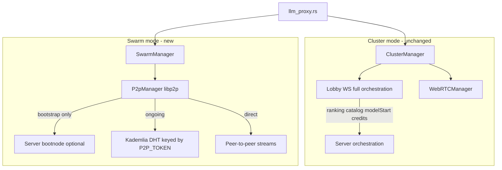
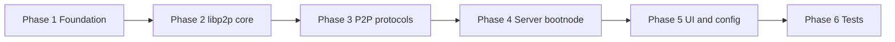

# Swarm Mode — Implementation Plan

Add a **Swarm** network mode alongside **Cluster**: peers bootstrap via a shared `P2P_TOKEN` and libp2p (the lobby server optionally runs the bootnode), then handle discovery, ranking, model catalog, model-start, and inference entirely P2P — with no credits or lobby orchestration.

See [NEXT_FEATURES.md](NEXT_FEATURES.md) §2 (libp2p refactoring) for the broader transport migration. Swarm mode is **Phase 1** of that migration.

| Document | Topic |
|----------|-------|
| [NEXT_FEATURES.md](NEXT_FEATURES.md) | Roadmap index |
| This file | Swarm mode plan and todos |
| [A2A_INFERENCE.md](A2A_INFERENCE.md) | Agent-to-agent inference |

---

## Implementation todos

- [x] **foundation** — Add `NetworkMode` / `SwarmMembership` config, `SwarmStatus` in `client/src/shared.rs`, and `SwarmManager` skeleton mirroring `ClusterManager` command routing
- [x] **libp2p-core** — Implement `client/src/p2p_manager.rs` with `rust-libp2p`: identity, TCP/QUIC, rendezvous, Kademlia DHT, AutoNAT, identify, relay client
- [x] **peer-ranking** — Extract server ranking logic into `client/src/peer_ranking.rs`; wire `P2pManager` to rank peers locally from gossip/DHT cache
- [x] **p2p-protocols** — Implement gossipsub catalog sync, proxy stream protocol (port `DataChannelMessage` framing), and P2P model-start request/offer/progress messages
- [x] **server-bootnode** — Add optional `server/src/p2p/bootnode.rs` libp2p bootnode + `GET /api/p2p/bootnodes`; default client bootnodes point to lobby host
- [x] **llm-proxy-routing** — Extend `llm_proxy.rs` and `ProxyRequestCommand` to resolve `swarm_id`; aggregate `network_models` across clusters + swarms
- [x] **ui-swarm** — Add Swarm panel next to Clusters in `client/ui/v2/index.html`: join/create by `P2P_TOKEN`, connect/disconnect, disable credits UI for swarm scope
- [x] **api-endpoints** — Add client REST endpoints for swarm CRUD/connect/maintenance and expose `swarms` in `/api/client/status`
- [x] **tests-docs** — Add `client-tests` for peer ranking, catalog aggregation, and P2P protocol

---

## Server as bootnode

**Serverless Swarm** means the server is **not** in the orchestration/data path — not that mtrxAI cannot run a server process at all.

The lobby server can host a **libp2p bootnode + rendezvous** node:

- Peers dial the server bootnode on startup with a shared `P2P_TOKEN`
- Bootnode returns dialable multiaddrs of other peers in that swarm
- After bootstrap, peers join the **Kademlia DHT** and operate independently
- Bootnode is only needed for cold start; DHT gossip replaces it once the mesh is warm



---

## Cluster vs Swarm

| Aspect | **Cluster** (existing) | **Swarm** (new) |
|--------|------------------------|-----------------|
| Transport | WebRTC data channels | libp2p encrypted streams |
| Server role | WS signaling, catalog, ranking, model-start broker, credits | **Optional bootnode/rendezvous only** |
| Discovery | Lobby `GetPeersForModel` | DHT + gossip keyed by `P2P_TOKEN` |
| Node selection | Server `rank_peers_for_model` | Client-side port of same logic |
| Model start | Server `select_provider_peer` | P2P request/accept protocol between peers |
| Credits | PostgreSQL ledger + `reporttokenusage` | **Not available** |
| Global bans | Server moderation DB | Local block list only (`tx_db`) |
| Cluster CRUD | Server DB + REST | Local config: swarm name + `P2P_TOKEN` |
| Coexistence | Both modes can run on the same peer simultaneously | |

---

## Architecture changes

### 1. Network mode abstraction

Introduce a top-level **NetworkManager** (or extend `client/src/cluster_manager.rs`) that owns both transports:

- **Cluster path**: existing `WebRTCManager` per `ClusterMembership` — unchanged
- **Swarm path**: new `P2pManager` per `SwarmMembership`

Shared command surface stays the same:

- `ProxyRequestCommand` — add `swarm_id: Option<String>` (or generalize `cluster_id` → `network_scope_id` + `network_mode`)
- `ModelStartAction` — same generalization for swarm-scoped model warm

`llm_proxy.rs` routing change is minimal: resolve scope from `network_models` metadata (`_swarm` vs `_clusters`).

### 2. New client module: `p2p_manager.rs`

Replace WebRTC for Swarm only (Cluster keeps WebRTC until a later migration). Based on [NEXT_FEATURES.md](NEXT_FEATURES.md) §2:

**libp2p stack** (`rust-libp2p` in `client/Cargo.toml`):

- Identity: derive libp2p `PeerId` from existing `peer_id` in `peer_config.json` (or add `libp2p_keypair` field)
- Transports: TCP + QUIC (optional) + relay client
- Protocols: **rendezvous**, **Kademlia DHT**, **AutoNAT**, **identify**, **gossipsub** (for catalog gossip)
- Preserve proxy framing: port `DataChannelMessage` JSON chunks from `webrtc_manager.rs` to libp2p stream / request-response behaviour

**Responsibilities currently in server/WebRTC path, moved to P2P:**

| Today (server/WebRTC) | Swarm replacement |
|----------------------|-------------------|
| `UpdateModels` → `AvailableModels` broadcast | gossipsub topic `mtrxai/catalog/{hash(token)}` |
| `GetPeersForModel` → ranking | local DHT record lookup + client `peer_ranking.rs` |
| `Route` SDP relay | direct libp2p dial (hole punch / relay v2) |
| `RequestModelStart` broker | P2P `ModelStartRequest` / `ModelStartOffer` / progress messages |
| `reporttokenusage` | omitted in Swarm |

### 3. Client-side peer ranking

Extract server logic from `server/src/peers/ranking.rs` into shared crate or client module:

- `haversine_km`, `peer_load_score`, ASN preference — reuse as-is
- Input: local gossip cache of peer model entries + `PeerInfo` (geo/ASN from `peer_discovery.rs`)
- Output: ordered peer list for a model name

No server round-trip for inference routing.

### 4. Client-side model start (P2P)

New P2P protocol messages (mirror server semantics from `server/src/peers/model_start.rs`):

1. Requester broadcasts `ModelStartRequest { req_id, model }` on swarm gossip or sends to ranked candidates
2. Provider selection runs **locally on requester** using same `select_provider_peer` logic ported to client
3. Provider receives offer, accepts/rejects (respecting `accepting_jobs` / auto-approve settings)
4. Progress + completion reported over P2P; catalog updated via gossipsub

Server `model_start_requests` state map is not used in Swarm.

### 5. Server: optional bootnode role

Add a lightweight libp2p service to the server binary (or feature-gated submodule `server/src/p2p/bootnode.rs`):

- Listens on configurable multiaddr (e.g. `/ip4/0.0.0.0/tcp/4001`)
- Runs rendezvous + optional Kademlia bootstrap node
- **Does not** relay inference, rank peers, or settle credits for Swarm traffic

**Client config defaults:**

```toml
# peer_config.json / env
MTRXAI_P2P_MODE=swarm          # cluster | swarm | both
MTRXAI_BOOTNODES=/ip4/127.0.0.1/tcp/4001/p2p/<server-peer-id>   # default: lobby host
P2P_TOKEN=<shared-secret>    # DHT key namespace per swarm
```

**Optional REST hint** (convenience, not required for P2P):

- `GET /api/p2p/bootnodes` — returns default bootnode multiaddrs
- No WS connection required for Swarm peers

Existing Cluster lobby WS (`server/src/ws/handler.rs`) stays unchanged for Cluster mode.

### 6. Config and persistence

Extend `client/src/client_config.rs`:

```rust
pub struct SwarmMembership {
    pub swarm_id: String,       // local UUID
    pub name: Option<String>,
    pub p2p_token: String,      // shared join secret
    pub bootnodes: Vec<String>, // multiaddrs; default from lobby REST or env
    pub connected: Option<bool>,
    pub accepting_jobs: Option<bool>,
}
// ClientConfig.swarm: Vec<SwarmMembership>
```

Swarm join flow: user enters or generates `P2P_TOKEN` + optional bootnode override; no server cluster CRUD.

### 7. UI: Swarm next to Cluster

In `client/ui/index.html`:

- **Setup wizard step 2**: toggle **Cluster** | **Swarm** (or both)
- **Network dashboard tab**: split into two panels — existing Clusters list + new **Swarms** list
  - Swarm card: name, token (masked), bootnode status, peer in/out counts, per-swarm models
  - Actions: join swarm (paste token), create swarm (generate token), connect/disconnect, maintenance
- **Run model tab**: when model spans swarms, show swarm scope (same pattern as cluster picker)
- Hide/disable in Swarm context: credits balance refresh, transaction sync indicators, global report-to-lobby (keep local block)

Status API (`client/src/api/mod.rs`): add `swarms: Vec<SwarmStatus>` alongside `clusters`.

### 8. Features explicitly unavailable in Swarm

Document in UI tooltips and disable controls:

- Credit ledger / `reporttokenusage` settlement
- Authoritative transaction history sync from lobby
- Server global peer bans (local `block_peer` only)
- Server-mediated model catalog DB for remote VRAM metadata — use local registry + peer-advertised metadata instead
- Cluster CRUD via lobby REST

Local features that **continue to work**: `llm_registry`, local inference, `llm_proxy`, GPU probe, local tx cache.

---

## libp2p refactoring linkage

Swarm mode is the **first production consumer** of the libp2p stack described in [NEXT_FEATURES.md](NEXT_FEATURES.md) §2:

| libp2p roadmap item | Swarm implementation |
|--------------------|----------------------|
| `p2p_manager.rs` replaces `webrtc_manager.rs` | Swarm only first; Cluster stays WebRTC |
| `P2P_TOKEN` DHT keys | Per-swarm membership |
| Bootnodes | Server bootnode (default) + env override |
| Preserve proxy protocol | Same JSON chunk framing over libp2p streams |
| Migration feature flag | `MTRXAI_P2P_MODE=cluster\|swarm\|both` |
| Deprecate SDP `Route` | Swarm path never uses WS signaling |
| Optional lobby WS | Cluster only (credits + orchestration) |

**Later phase** (post-Swarm MVP): migrate Cluster mode from WebRTC to libp2p while keeping full lobby orchestration for credits — reusing the same `P2pManager` with an `orchestration: ServerMediated | Decentralized` flag.

---

## Phased delivery



| Phase | Todo IDs |
|-------|----------|
| 1 Foundation | `foundation` |
| 2 libp2p core | `libp2p-core` |
| 3 P2P protocols | `peer-ranking`, `p2p-protocols` |
| 4 Server bootnode | `server-bootnode` |
| 5 UI and routing | `llm-proxy-routing`, `ui-swarm`, `api-endpoints` |
| 6 Tests | `tests-docs` |

---

## Key files to create/modify

| File | Change |
|------|--------|
| `client/src/p2p_manager.rs` | **New** — libp2p Swarm, bootstrap, streams |
| `client/src/swarm_manager.rs` | **New** — mirrors cluster_manager fan-out |
| `client/src/peer_ranking.rs` | **New** — extracted from server ranking |
| `client/src/p2p_protocol.rs` | **New** — catalog gossip, model-start, proxy messages |
| `client/src/client_config.rs` | SwarmMembership + config fields |
| `client/src/shared.rs` | SwarmStatus, extend commands |
| `client/src/lib.rs` | Wire SwarmManager |
| `client/src/llm_proxy.rs` | Route to swarm scope |
| `client/src/api/mod.rs` | Swarm REST endpoints |
| `client/ui/index.html` | Swarm UI panel |
| `server/src/p2p/bootnode.rs` | **New** — optional bootnode service |
| `server/Cargo.toml` | libp2p deps (feature-gated) |

---

## Success criteria

- Two peers on different networks join the same swarm with only a shared `P2P_TOKEN`, bootstrapping via server bootnode (default) or custom bootnodes
- Remote inference works with no lobby WS connection in Swarm mode
- Model start warm-up completes via P2P negotiation
- Cluster mode unchanged and can run in parallel (`MTRXAI_P2P_MODE=both`)
- Credits/transactions UI clearly disabled or hidden for Swarm-scoped activity
- Symmetric-NAT peers connect via libp2p relay with E2E encryption
